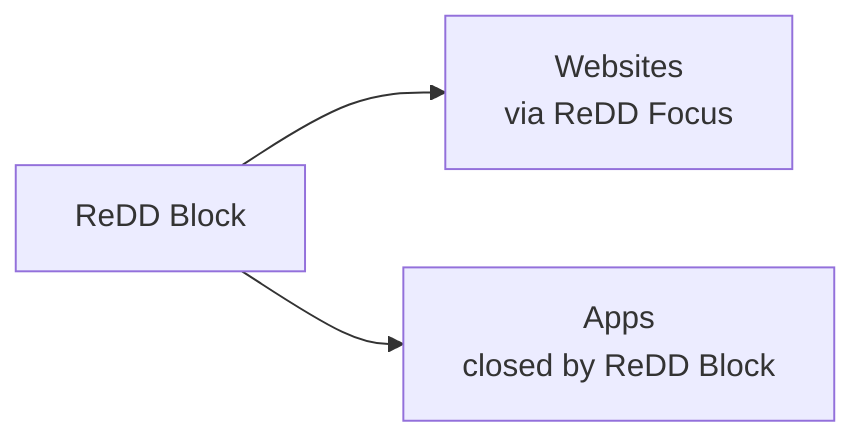

# ReDD Block

Block distracting websites and apps with scheduled or one-off blocks and customisable difficulty to override. Stay focused on what matters.

Built by computer scientists at the University of Oxford (Dr Ulrik Lyngs) and the University of Maastricht (Dr Konrad Kollnig), as part of the Reduce Digital Distraction project ([reddfocus.org](https://reddfocus.org)).

## Features

- **Cross-Platform** — Works on macOS 11+, Windows 10+, iOS (iPad/iPhone), and Android (source code for the Android version is here: https://github.com/kasnder/redd-block-android)
- **Website Blocking** — ReDD Block decides what to block; the **ReDD Focus** browser extension does the blocking in Chrome, Brave, Edge, Firefox, and Safari. On iOS, blocking uses Screen Time instead.
- **App Blocking** — Closes distracting apps on desktop (warning overlay → save window → polite quit → force-close if needed; Screen Time shield overlay on iOS)
- **Flexible Blocklists** — Create multiple lists with custom names, colors, and emojis
- **One-Off Blocks** — Quick blocks for immediate focus sessions
- **Scheduled Blocks** — Set recurring blocks on specific days/times (e.g., block social media Mon-Fri 9am-5pm)
- **Visual Calendar** — See all your scheduled and active blocks on an interactive weekly timeline
- **Override Protection** — Configurable typing challenges prevent impulsive unblocking
- **Background Operation** — Blocks continue even when the app is closed
- **Theme Options** — Auto, light, or dark mode

## How it works

> **New in v2.** ReDD Block no longer edits your system `hosts` file and no longer runs a privileged background helper daemon — both were part of v1.x. Website blocking now goes through the **ReDD Focus** browser extension instead. You don't need an admin password to install or run v2 (macOS may ask once when cleaning up leftover v1.x components).

ReDD Block is **one app**. When you start a block, it does two things:

| | What gets blocked | Who does the blocking |
|---|-------------------|------------------------|
| **Websites** | URLs in your blocklists | **ReDD Focus** — a browser extension |
| **Apps** | Programs in your blocklists | **ReDD Block** — closes them for you |



### Website blocking (desktop)

**ReDD Block** stores your blocklists. **ReDD Focus** (the extension in your browser) blocks the actual pages. The extension has to ask ReDD Block what to block — browsers do that in two different ways:

**Chrome, Brave, Edge, Firefox**

1. The extension needs the current blocklist.
2. The browser **cannot read ReDD Block's window**, so it wakes up ReDD Block **in the background** — same app you installed, **no new window appears**.
3. ReDD Block sends the list to the extension and exits.
4. The extension blocks matching sites.

You never open anything extra or run a second program. It's just how Chrome/Firefox talk to local apps.

**Safari (macOS)**

1. ReDD Block writes the blocklist to a **shared file** on your Mac.
2. The ReDD Focus extension (bundled inside ReDD Block — **ReDD Focus (via ReDD Block)** in Safari → Settings → Extensions) reads that file.

| Browser | Where to get the extension |
|---------|---------------------------|
| Chrome, Brave, Edge, Firefox | Browser extension store (ReDD Block can auto-install where supported) |
| Safari | Already inside ReDD Block — just enable it in Safari → Settings → Extensions |

While a block is active, ReDD Block also checks that the extension is still installed, enabled, and allowed in private/incognito windows. If not, it can warn you or quit the browser.

### App blocking (desktop)

| Step | What happens |
|------|----------------|
| 1 | **"Let's go!"** warning — you click when ready |
| 2 | **30 seconds** to save work and quit on your own |
| 3 | ReDD Block asks the app to close politely |
| 4 | Still open after **10 seconds**? Force-closed |

If you **open** a blocked app mid-block, ReDD Block skips the warning and closes it on the fast path.

ReDD Block runs from the menu bar / system tray and can start at login so blocking continues across sessions.

### iOS

No browser extension — ReDD Block uses **Screen Time** to shield websites and apps. Scheduled blocks work via a background monitor extension even when the app is closed. Details: [architecture.md](architecture.md).

### Permissions (desktop)

- **Extensions:** install ReDD Focus in each browser you use (Safari's copy ships inside ReDD Block).
- **macOS (optional):** Full Disk Access can help Safari setup diagnostics; private-browsing status is reported by the extension itself.
- **No** admin or UAC prompt at install time.

### Upgrading from v1.x

If you previously ran ReDD Block 1.x (helper daemon + hosts file), the first launch after upgrade:

1. Cleans up the old hosts-file entries and helper daemon (macOS may ask for your password once).
2. Registers launch-at-login and browser extension hooks.
3. Walks you through ReDD Focus setup in your browsers.

### Developers

Implementation details, module map, and the iOS Screen Time pipeline: [architecture.md](architecture.md) and [browser-ext-migration/V2_OVERVIEW.md](browser-ext-migration/V2_OVERVIEW.md).

## Local Development

### Prerequisites

- [Node.js](https://nodejs.org/) (v18+)
- [Rust](https://www.rust-lang.org/tools/install) (latest stable)
- [Tauri CLI](https://tauri.app/start/prerequisites/)

**Windows additional requirements:**
- Visual Studio Build Tools with C++ workload

**iOS additional requirements:**
- Xcode 15+
- An Apple Developer account
- A physical iOS device (Screen Time APIs don't work in the simulator)

### Getting Started

```bash
# Clone the repository
git clone https://github.com/ulyngs/redd-block.git
cd redd-block

# Install dependencies
npm install

# Run in development mode
npm run dev

# Run on iOS device (opens Xcode, then press ⌘R to build)
npm run dev:ios
```

The app will open automatically. Hot-reloading is enabled for both frontend (Vite) and backend (Tauri).

### Building

```bash
# macOS: Universal binary (Intel + Apple Silicon) → .app
# (embeds the Safari Web Extension, signs + notarizes + staples)
npm run build:mac

# macOS: Wrap the .app into a signed/notarized .pkg installer
# (outputs reddblock-{version}.pkg)
npm run build:mac-pkg

# macOS: Both in one go (.app + .pkg)
npm run build:mac-all

# Windows: NSIS/MSI installers (x64 + ARM64)
npm run build:win

# iOS: Build IPA for App Store upload (via Transporter)
npm run build:ios
```

Built artifacts are copied to `for-distribution/` for upload or direct distribution.

### Testing

Testing is organized into two automated tiers plus a manual checklist:

**1. Unit Tests (in-app, instant)**

Tests blocking logic — time-based scenarios, overlaps, overrides, override-all state transitions, and challenge difficulty selection. No system modification.

```bash
npm run dev                   # Start the app
# Press Cmd+Shift+T (Mac) or Ctrl+Shift+T (Windows)
# Or type in the dev console: runBlockingTests()
```

**2. Integration Tests (in-app, profile-based)**

Creates real blocks using safe `.invalid` domains and verifies enforcement end-to-end through the app. Covers Screen Time / native-host sync, schedule activation, one-off pause/resume, overlap safety, scoped clear, and diagnostics parity.

```bash
# In the dev console:
runIntegrationTests('core')   # default, faster critical checks
runIntegrationTests('full')   # core + expanded non-UI coverage
```

**3. Manual Checklist**

See `scripts/manual-test-checklist.md` for the full pre-release checklist. Key items for the current architecture: Screen Time authorization flow (iOS), browser-extension install + enforcer grace timer (desktop), hide-on-close + launch-at-login, first-launch migration off the legacy helper.

## Project Structure

```
redd-block/
├── src/                          # Frontend (HTML/JS/CSS)
│   ├── index.html                # Main app layout
│   ├── app.js                    # App logic & UI
│   └── styles.css                # Styling
├── src-tauri/                    # Tauri backend (Rust)
│   ├── src/
│   │   ├── lib.rs                # App setup, tray, hide-on-close, autostart
│   │   ├── app_watcher.rs        # In-process app watcher (sysinfo poll + quit)
│   │   ├── enforcer.rs           # Browser-extension compliance loop (macOS + Windows)
│   │   ├── native_host.rs        # Headless native-messaging host (Chrome/Firefox blocklist feed)
│   │   ├── native_host_install.rs # Registers native-messaging manifests
│   │   ├── profile_scan.rs       # Reads browser profile files
│   │   └── commands/             # IPC commands (data, apps, migration, …)
│   ├── entitlements.macos.plist  # App Group (group.com.reddblock.shared)
│   ├── gen/apple/                # Generated Xcode project
│   ├── tauri.conf.json           # Shared Tauri config
│   ├── tauri.ios.conf.json       # iOS-specific config
│   ├── tauri.macos.conf.json     # macOS-specific config
│   └── tauri.windows.conf.json   # Windows-specific config
├── redd-focus-web/               # Vendored ReDD Focus Safari extension source
├── tauri-plugin-screentime/      # iOS Screen Time plugin (desktop uses extension path)
│   ├── ios/Sources/              # Swift plugin (FamilyActivityPicker, ManagedSettings)
│   ├── src/                      # Rust bindings
│   └── permissions/              # Plugin permissions
├── browser-ext-migration/
│   ├── MIGRATION_PLAN.md         # Rollout plan + remaining-work checklist
│   ├── FUTURE_OPTIONS.md         # Parked localhost fallback + signed .pkg notes
├── scripts/                      # Build/signing (build-safari-extension.sh, embed-safari-extension.sh, …)
├── docs/                         # GitHub Pages (version info, App Store privacy policy)
└── vite.config.js                # Vite dev server config
```

## Version Management

| Component | Version Location |
|-----------|------------------|
| **App** | `package.json`, `src-tauri/tauri.conf.json`, `src-tauri/Cargo.toml` |
| **Published versions** | `docs/latest-versions.json` (macOS, Windows, iOS) |

Use `./scripts/bump-version.sh <version>` to update the app version in all files at once.

## Data Storage

### App Data

| Platform | Location |
|----------|----------|
| macOS | `~/Library/Application Support/com.reddblock/redd-block-data.json` |
| Windows | `%AppData%\com.reddblock\redd-block-data.json` |
| iOS | App sandbox (managed by Tauri) |

Legacy v1 paths under `com.redd.block` are still read as a fallback during migration.

Contains blocklists, schedules, active blocks, and settings.

On Windows the built-in native-messaging host reads this file directly to derive the current blocklist for the extension — no separate IPC channel.

### Uninstall Behavior

User data is preserved unless manually deleted. Uninstalling the app also removes:

- the launch-at-login / login-item entry registered by `tauri-plugin-autostart`,
- the native-messaging manifests and registry keys (Windows) / files (macOS) written by `install_native_host`.

Active blocks stop firing once the app is gone because the app itself is now the enforcement engine. A paid-for-itself "keep blocking after uninstall" mode is no longer provided.

## Requirements

- **macOS**: 11.0+ (Big Sur or later) — required for Safari Web Extensions
- **Windows**: 10+ (version 1809 or later)
- **iOS**: 16.0+ (iPhone and iPad)
- **Android**: see https://github.com/kasnder/redd-block-android
- **Linux**: Coming soon

## Tech Debt

- **Rename `updateHostsFile()`**: misleading now that no platform writes a hosts file. On desktop it's a no-op notify (the native messaging host re-reads the file on change). Consider renaming to `syncWebsiteBlocking()`.
- **Frontend still calls legacy `*_via_helper` commands** via the shim in `src-tauri/src/commands/helper_shim.rs`. Rewrite `src/app.js` to call `set_blocked_apps` / `scan_browser_profiles` / Screen Time plugin commands directly and delete the shim.
