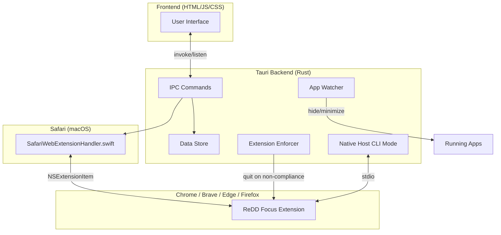
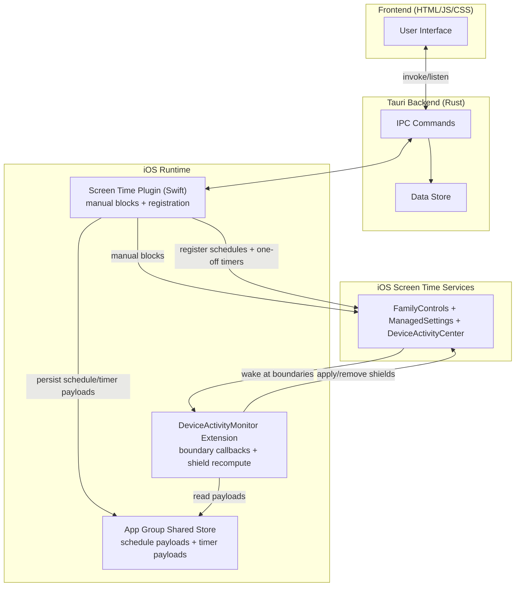

# ReDD Block

Block distracting websites and apps with scheduled or one-off blocks and customisable difficulty to override. Stay focused on what matters.

Built by computer scientists at the University of Oxford (Dr Ulrik Lyngs) and the University of Maastricht (Dr Konrad Kollnig), as part of the Reduce Digital Distraction project ([reddfocus.org](https://reddfocus.org)).

## Features

- **Cross-Platform** — Works on macOS 11+, Windows 10+, iOS (iPad/iPhone), and Android (source code for the Android version is here: https://github.com/kasnder/redd-block-android)
- **Website Blocking** — Via the ReDD Focus browser extension on desktop (Chrome/Brave/Edge/Firefox via a built-in native messaging host; Safari via the app's own `SafariWebExtensionHandler`). On iOS it's the Screen Time API.
- **App Blocking** — Automatically blocks distracting apps (minimizes/hides on desktop via in-process watcher, Screen Time shield overlay on iOS)
- **Flexible Blocklists** — Create multiple lists with custom names, colors, and emojis
- **One-Off Blocks** — Quick blocks for immediate focus sessions
- **Scheduled Blocks** — Set recurring blocks on specific days/times (e.g., block social media Mon-Fri 9am-5pm)
- **Visual Calendar** — See all your scheduled and active blocks on an interactive weekly timeline
- **Override Protection** — Configurable typing challenges prevent impulsive unblocking
- **Background Operation** — Blocks continue even when the app is closed
- **Theme Options** — Auto, light, or dark mode

## Architecture

### Desktop

One unprivileged Tauri binary per OS. No helper daemon, no hosts file,
no admin prompt. Website blocking goes through the ReDD Focus browser
extension on both OSes:

- **Chrome / Brave / Edge / Firefox** talk to the app via native
  messaging. The Tauri binary runs in `--native-host` mode (argv flag)
  and speaks the stdio-framed JSON protocol; the install step writes
  per-browser manifest JSON (macOS) or `HKCU\…\NativeMessagingHosts`
  registry keys (Windows). Entirely user-scope.
- **Safari** (macOS) routes through `SafariWebExtensionHandler.swift`
  inside the signed `.app` bundle, which implements the same
  `{ blocklist: […] }` protocol.
- An in-app **enforcement loop** scans running browsers every ~5 s
  (using the Rust-ported profile-scan code) and nags / quits any
  browser whose ReDD Focus extension is missing, disabled, or not
  allowed in private browsing.

App blocking runs in-process on both OSes (AppleScript hide on macOS,
`SetWinEventHook` + `ShowWindow` on Windows). Scheduled blocks, pause /
resume, one-off blocks, and override challenges all work without a
separate daemon because the app launches at login and hides on close.



### iOS (iPad / iPhone)



## How It Works

### Website Blocking

**Desktop (macOS / Windows):** Website blocking uses the ReDD Focus browser extension. The app registers itself as a native-messaging host, derives the current blocklist from `redd-block-data.json`, and pushes it over stdio to the extension running in Chrome / Brave / Edge / Firefox. Safari (macOS) routes through a `SafariWebExtensionHandler` inside the signed `.app` bundle that speaks the same protocol. A background loop in the app scans running browsers every ~5 seconds and quits any that have the extension missing, disabled, or not allowed in private browsing.

**iOS:** Website blocking uses the Screen Time API's `WebContentSettings` to block domains at the OS level. Users type in domains to block, and the app applies them via a `ManagedSettingsStore`. One-time authorization in Settings → Screen Time.

### App Blocking

**Desktop (macOS / Windows):** The app itself uses event-driven monitoring to detect when blocked apps are launched or brought to focus, then immediately hides/minimizes them. No elevated privileges required. App blocking persists as long as the app is running — the app hides to tray on close and launches automatically at login so blocks keep firing across sessions.

**iOS:** App blocking uses the Screen Time API's `ManagedSettingsStore` to apply a shield overlay on selected apps and categories.

### Scheduled Blocking on iOS

Yes, scheduled blocking is technically supported on iOS. ReDD Block implements it through Apple's Screen Time stack:

- The app saves schedule payloads (domains/app/category tokens) in an App Group store.
- The app registers schedule windows with `DeviceActivityCenter`.
- At schedule boundaries, the system wakes the `DeviceActivityMonitor` extension (even when the app is closed), which reads the shared payloads and applies/removes shields via a named `ManagedSettingsStore`.
- Short iOS schedules still work, but under the hood they must respect Apple's 15-minute minimum `DeviceActivitySchedule` interval and use warning callbacks for the real end time.

This is why iOS scheduled blocking is possible without a desktop-style helper daemon.

| Platform | Detection Method | Hide Method |
|----------|------------------|-------------|
| macOS | NSWorkspace notifications (in-process, Accessibility TCC) | `set visible of application process to false` |
| Windows | SetWinEventHook for foreground changes (in-process) | ShowWindow with SW_FORCEMINIMIZE |
| iOS | Screen Time `ManagedSettingsStore` | Shield overlay via `ShieldSettings` |

### Authorization prompts (desktop)

- **Both OSes**: users install the ReDD Focus extension from the Chrome Web Store / Firefox Add-ons / Edge Add-ons. For Safari (macOS), the extension is bundled inside the signed `.app` and the user enables it in Safari → Settings → Extensions.
- **macOS**: the first time app blocking fires, macOS prompts for Accessibility / Automation permission so the app can call `System Events` to hide blocked apps.
- No admin or UAC prompt on either OS.

### First launch after upgrade

An app that was previously installed at v1.0.x has a privileged helper daemon + redd-block entries in the hosts file. On first launch after upgrade the app:

1. Strips its own section from `/etc/hosts` (macOS) or `C:\Windows\System32\drivers\etc\hosts` (Windows).
2. Removes the launchd daemon / Scheduled Task and helper binary (macOS prompts once for the admin password; Windows cleans up user-scope state silently).
3. Registers itself as a launch-at-login item and a native-messaging host (both OSes).
4. Prompts the user to install the ReDD Focus extension if not already present in any running browser.

## Local Development

### Prerequisites

- [Node.js](https://nodejs.org/) (v18+)
- [Rust](https://www.rust-lang.org/tools/install) (latest stable)
- [Tauri CLI](https://tauri.app/start/prerequisites/)

**Windows additional requirements:**
- Visual Studio Build Tools with C++ workload

**iOS additional requirements:**
- Xcode 15+
- An Apple Developer account
- A physical iOS device (Screen Time APIs don't work in the simulator)

### Getting Started

```bash
# Clone the repository
git clone https://github.com/ulyngs/redd-block.git
cd redd-block

# Install dependencies
npm install

# Run in development mode (syncs helper and starts Tauri)
npm run dev

# Run on iOS device (opens Xcode, then press ⌘R to build)
npm run dev:ios
```

The app will open automatically. Hot-reloading is enabled for both frontend (Vite) and backend (Tauri).

### Building

```bash
# macOS: Universal binary (Intel + Apple Silicon) → DMG
npm run build:mac

# Windows: NSIS/MSI installers (x64 + ARM64)
npm run build:win

# iOS: Build IPA for App Store upload (via Transporter)
npm run build:ios
```

Built artifacts are copied to `for-distribution/` for upload or direct distribution.

### Testing

Testing is organized into two automated tiers plus a manual checklist:

**1. Unit Tests (in-app, instant)**

Tests blocking logic — time-based scenarios, overlaps, overrides, override-all state transitions, and challenge difficulty selection. No system modification.

```bash
npm run dev                   # Start the app
# Press Cmd+Shift+T (Mac) or Ctrl+Shift+T (Windows)
# Or type in the dev console: runBlockingTests()
```

**2. Integration Tests (in-app, profile-based)**

Creates real blocks using safe `.invalid` domains and verifies enforcement end-to-end through the app. Covers Screen Time / native-host sync, schedule activation, one-off pause/resume, overlap safety, scoped clear, and diagnostics parity.

```bash
# In the dev console:
runIntegrationTests('core')   # default, faster critical checks
runIntegrationTests('full')   # core + expanded non-UI coverage
```

**3. Manual Checklist**

See `scripts/manual-test-checklist.md` for the full pre-release checklist. Key items for the new architecture: Screen Time authorization flow (macOS), browser-extension install + enforcer grace timer (Windows), hide-on-close + launch-at-login, first-launch migration off the legacy helper.

## Project Structure

```
redd-block/
├── src/                          # Frontend (HTML/JS/CSS)
│   ├── index.html                # Main app layout
│   ├── app.js                    # App logic & UI
│   └── styles.css                # Styling
├── src-tauri/                    # Tauri backend (Rust)
│   ├── src/
│   │   ├── lib.rs                # App setup, tray, hide-on-close, autostart
│   │   ├── app_watcher.rs        # In-process app watcher (NSWorkspace / SetWinEventHook)
│   │   ├── enforcer.rs           # Browser-extension compliance loop (Windows)
│   │   ├── native_host.rs        # --native-host CLI mode (stdio framing)
│   │   ├── native_host_install.rs # Registers native-messaging manifests
│   │   ├── profile_scan.rs       # Reads browser profile files
│   │   └── commands/             # IPC commands (data, apps, migration, …)
│   ├── entitlements.macos.plist  # com.apple.developer.family-controls
│   ├── gen/apple/                # Generated Xcode project
│   ├── tauri.conf.json           # Shared Tauri config
│   ├── tauri.ios.conf.json       # iOS-specific config
│   ├── tauri.macos.conf.json     # macOS-specific config
│   └── tauri.windows.conf.json   # Windows-specific config
├── tauri-plugin-screentime/      # iOS Screen Time plugin (desktop uses extension path)
│   ├── ios/Sources/              # Swift plugin (FamilyActivityPicker, ManagedSettings)
│   ├── src/                      # Rust bindings
│   └── permissions/              # Plugin permissions
├── browser-ext-migration/
│   ├── MIGRATION_PLAN.md         # Rollout plan + remaining-work checklist
│   └── redd-focus-web.patch      # In-progress Safari extension changes (deferred)
├── scripts/                      # Build and signing scripts
├── docs/                         # GitHub Pages (version info, App Store privacy policy)
└── vite.config.js                # Vite dev server config
```

## Version Management

| Component | Version Location |
|-----------|------------------|
| **App** | `package.json`, `src-tauri/tauri.conf.json`, `src-tauri/Cargo.toml` |
| **Published versions** | `docs/latest-versions.json` (macOS, Windows, iOS) |

Use `./scripts/bump-version.sh <version>` to update the app version in all files at once.

## Data Storage

### App Data

| Platform | Location |
|----------|----------|
| macOS | `~/Library/Application Support/com.redd.block/redd-block-data.json` |
| Windows | `%AppData%\com.redd.block\redd-block-data.json` |
| iOS | App sandbox (managed by Tauri) |

Contains blocklists, schedules, active blocks, and settings.

On Windows the built-in native-messaging host reads this file directly to derive the current blocklist for the extension — no separate IPC channel.

### Uninstall Behavior

User data is preserved unless manually deleted. Uninstalling the app also removes:

- the launch-at-login / login-item entry registered by `tauri-plugin-autostart`,
- the native-messaging manifests and registry keys (Windows) / files (macOS) written by `install_native_host`.

Active blocks stop firing once the app is gone because the app itself is now the enforcement engine. A paid-for-itself "keep blocking after uninstall" mode is no longer provided.

## Requirements

- **macOS**: 11.0+ (Big Sur or later) — required for Safari Web Extensions
- **Windows**: 10+ (version 1809 or later)
- **iOS**: 16.0+ (iPhone and iPad)
- **Android**: see https://github.com/kasnder/redd-block-android
- **Linux**: Coming soon

## Tech Debt

- **Rename `updateHostsFile()`**: misleading now that no platform writes a hosts file. On desktop it's a no-op notify (the native messaging host re-reads the file on change). Consider renaming to `syncWebsiteBlocking()`.
- **Frontend still calls legacy `*_via_helper` commands** via the shim in `src-tauri/src/commands/helper_shim.rs`. Rewrite `src/app.js` to call `set_blocked_apps` / `scan_browser_profiles` / Screen Time plugin commands directly and delete the shim.
