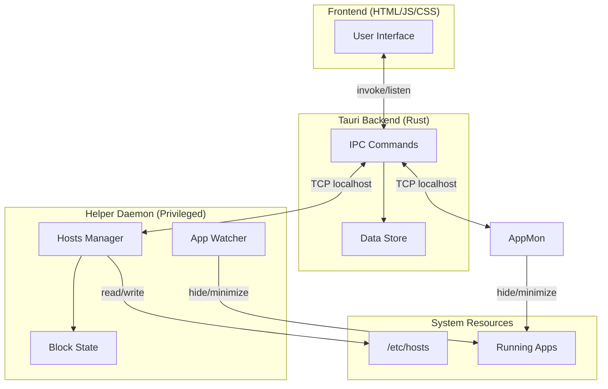
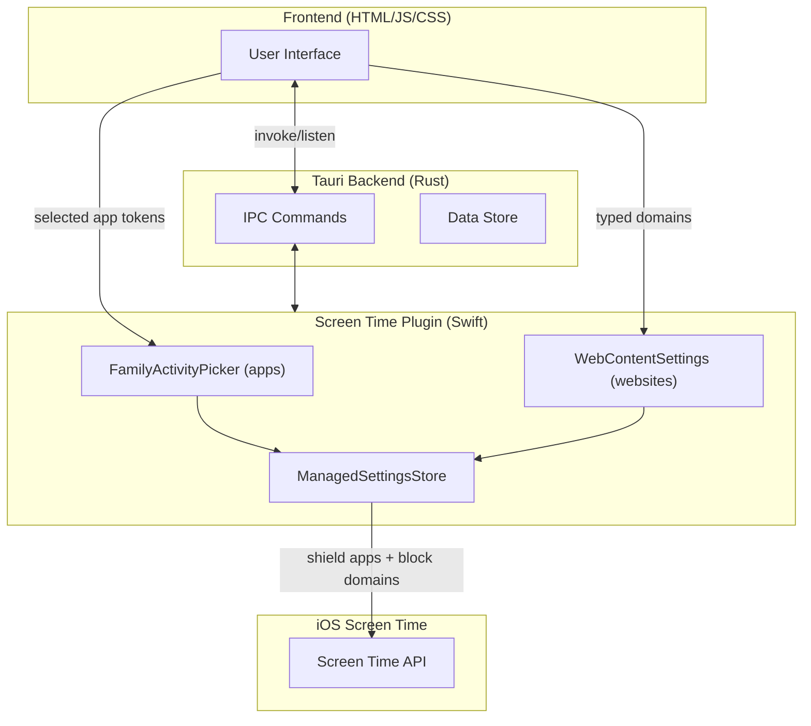

# ReDD Block (Beta)

Block distracting websites and apps with scheduled or one-off blocks. Stay focused on what matters.

Built by reddfocus.org with <3 (and with [Tauri 2](https://tauri.app/) for a lightweight, cross-platform app!).

## Features

- **Website Blocking** — System-level hosts file blocking works across all browsers
- **App Blocking** — Automatically minimizes/hides distracting apps when launched or focused
- **iOS App Blocking** — Native Screen Time integration with FamilyActivityPicker for selecting apps/categories to block
- **Flexible Blocklists** — Create multiple lists with custom names, colors, and emojis
- **Scheduled Blocks** — Set recurring blocks on specific days/times (e.g., block social media Mon-Fri 9am-5pm)
- **One-Off Blocks** — Quick blocks for immediate focus sessions
- **Visual Calendar** — See all your scheduled and active blocks on an interactive weekly timeline
- **Override Protection** — Configurable typing challenges prevent impulsive unblocking
- **Background Operation** — Blocks continue even when the app is closed
- **Cross-Platform** — Works on macOS, Windows, and iOS (iPad/iPhone)
- **Theme Options** — Auto, light, or dark mode

## Architecture

### Desktop (macOS / Windows)



### iOS (iPad / iPhone)



## How It Works

### Website Blocking

A privileged helper daemon modifies the system hosts file to redirect blocked domains to `0.0.0.0`. Blocks persist across app restarts and work in all browsers.

| Platform | Hosts File | Helper Location |
|----------|------------|-----------------|
| macOS | `/etc/hosts` | `/Library/PrivilegedHelperTools/com.redd.block.helper` (launchd daemon) |
| Windows | `C:\Windows\System32\drivers\etc\hosts` | Scheduled Task (runs at logon) |
| iOS | N/A (uses Screen Time) | N/A |

### App Blocking

The helper daemon uses event-driven monitoring to detect when blocked apps are launched or brought to focus, then immediately hides/minimizes them. App blocking persists even when the main app is closed.

| Platform | Detection Method | Hide Method |
|----------|------------------|-------------|
| macOS | NSWorkspace notifications (via helper daemon) | `set visible of application process to false` |
| Windows | SetWinEventHook for foreground changes (via helper daemon) | ShowWindow with SW_MINIMIZE |
| iOS | Screen Time `ManagedSettingsStore` | Shield overlay via `ShieldSettings` |

### Helper Daemon

Runs with elevated privileges to manage hosts file changes. On first use, requests admin credentials once. After setup, blocks start instantly without prompts.

- **macOS**: Installed as a launchd daemon, authorized via password prompt
- **Windows**: Installed as a Scheduled Task with highest privileges, authorized via UAC prompt
- **Troubleshooting**: If websites remain blocked after all blocks are stopped, use the "Clean hosts file" button in Settings → Advanced Options to remove stale entries

## Local Development

### Prerequisites

- [Node.js](https://nodejs.org/) (v18+)
- [Rust](https://www.rust-lang.org/tools/install) (latest stable)
- [Tauri CLI](https://tauri.app/start/prerequisites/)

**Windows additional requirements:**
- Visual Studio Build Tools with C++ workload

**iOS additional requirements:**
- Xcode 15+
- An Apple Developer account
- A physical iOS device (Screen Time APIs don't work in the simulator)

### Getting Started

```bash
# Clone the repository
git clone https://github.com/ulyngs/redd-block.git
cd redd-block

# Install dependencies
npm install

# Run in development mode (syncs helper and starts Tauri)
npm run dev

# Run on iOS device (opens Xcode, then press ⌘R to build)
cargo tauri ios dev --open --host
```

The app will open automatically. Hot-reloading is enabled for both frontend (Vite) and backend (Tauri).

### Building

```bash
# Build for current platform
npm run tauri build

# macOS: Build universal binary (Intel + Apple Silicon)
npm run tauri build -- --target universal-apple-darwin

# Windows: Build for Microsoft Store (APPX)
npm run build:win
```

## Project Structure

```
redd-block/
├── src/                          # Frontend (HTML/JS/CSS)
│   ├── index.html                # Main app layout
│   ├── app.js                    # App logic & UI
│   └── styles.css                # Styling
├── src-tauri/                    # Tauri backend (Rust)
│   ├── src/
│   │   ├── lib.rs                # App setup & window config
│   │   └── commands/             # IPC commands
│   ├── gen/apple/                # Generated Xcode project
│   ├── tauri.conf.json           # Shared Tauri config
│   ├── tauri.ios.conf.json       # iOS-specific config
│   ├── tauri.macos.conf.json     # macOS-specific config
│   └── tauri.windows.conf.json   # Windows-specific config
├── tauri-plugin-screentime/      # iOS Screen Time plugin
│   ├── ios/Sources/              # Swift plugin (FamilyActivityPicker, ManagedSettings)
│   ├── src/                      # Rust bindings (commands, models, mobile/desktop)
│   └── permissions/              # Plugin permissions
└── helper-daemon/                # Privileged helper (Rust, desktop only)
    └── src/main.rs               # Hosts file management
```

## Version Management

The app and helper daemon are versioned independently:

| Component | Version Location |
|-----------|------------------|
| **App** | `package.json`, `src-tauri/tauri.conf.json`, `src-tauri/Cargo.toml` |
| **Helper daemon** | `helper-daemon/Cargo.toml` |
| **Expected helper version** | `src-tauri/src/commands/helper.rs` → `EXPECTED_HELPER_VERSION` |
| **Published versions** | `docs/latest-versions.json` (macOS, Windows, iOS) |

When updating the helper daemon:
1. Bump version in `helper-daemon/Cargo.toml`
2. Update `EXPECTED_HELPER_VERSION` in `helper.rs` to match

This separation avoids prompting users to reinstall the helper when only the app changes.

## Data Storage

### User Data

| Platform | Location |
|----------|----------|
| macOS | `~/Library/Application Support/ReddBlock/redd-block-data.json` |
| Windows | `%AppData%\ReddBlock\redd-block-data.json` |
| iOS | App sandbox (managed by Tauri) |

Contains blocklists, schedules, active blocks, and settings.

### Helper State

| Platform | Location |
|----------|----------|
| macOS | `/var/lib/redd-block/helper-state.json` |
| Windows | `C:\ProgramData\ReDD Block\helper-state.json` |
| iOS | N/A (uses Screen Time API) |

Tracks blocking state so blocks persist across app restarts.

### Uninstall Behavior

User data is preserved unless manually deleted. Reinstalling restores your blocklists and settings automatically.

## Requirements

- **macOS**: 10.15+ (Catalina or later)
- **Windows**: 10+ (version 1809 or later)
- **iOS**: 16.0+ (iPhone and iPad)
- **Linux**: Coming soon
- **Android**: Coming soon

## License

CC-BY-NC-ND-3.0

---

Made with ♥ by [reddfocus.org](https://reddfocus.org)
