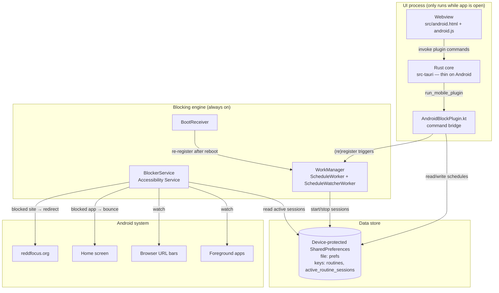
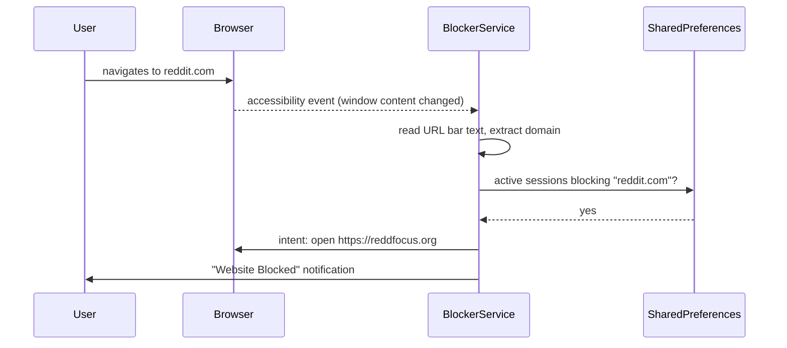

# ReDD Block Android — Architecture

How the Android version of ReDD Block works inside this repo: the data flow, the blocking engine, what is stored where, how to run and build it, and what's needed to ship it to the Play Store.

The Android app is a port of [redd-block-android](https://github.com/kasnder/redd-block-android) into the shared Tauri codebase. **Functionality is identical to that app**; the UI was rebuilt in the ReDD design language shared with the desktop and iOS apps. The companion docs are [README.md](README.md) (all platforms) and [architecture.md](architecture.md) (desktop + iOS internals).

---

## 1. The big picture

ReDD Block Android is **two programs in one APK** that share a data store but run independently:

1. **The UI** — a Tauri webview (`src/android.html` + `android.js` + `android.css`) where the user manages schedules and permissions. It is *never* needed for blocking.
2. **The blocking engine** — native Kotlin living in `tauri-plugin-androidblock/android/`: an Accessibility Service watches the foreground app/browser, and WorkManager fires schedule start/stop times. It keeps running when the app is swiped away and resumes after reboot.



Key consequence of this split: **closing the app does not stop blocking.** The webview is a remote control; the engine owns the data and the enforcement.

## 2. How blocking works

### App blocking

`BlockerService` is an Android **Accessibility Service** ([BlockerService.kt](tauri-plugin-androidblock/android/src/main/java/com/reddblock/androidblock/BlockerService.kt)). Android calls `onAccessibilityEvent` whenever window content changes. For every event:

1. Skip if the device is locked, or the event is from ReDD Block itself, or from a non-launchable system package.
2. Ask `Schedules.isAppBlocked(packageName)` — true if **any active session** lists the package.
3. If blocked: `performGlobalAction(GLOBAL_ACTION_HOME)` bounces the user to the home screen and a high-priority "App Blocked" notification is posted.

### Website blocking

The same service watches the **URL bar** of supported browsers. It keeps a map of browser package → URL-bar view IDs (Firefox, Chrome, Brave, Edge, Samsung Internet, Opera, Vivaldi, Kiwi, DuckDuckGo, Ecosia, Huawei, AOSP, Google app). On a window-content event from one of these:

1. Throttled to one check per 500 ms; skipped while the URL bar is focused (user is typing — don't block on autocomplete suggestions).
2. The URL text is read from the view, the hostname extracted (lowercased, `www.` stripped).
3. `Schedules.isWebsiteBlocked(domain)` — true if any active session lists the domain or a parent of it (`reddit.com` blocks `old.reddit.com`).
4. If blocked: the browser is sent an intent to open **`https://reddfocus.org`** (falling back to a home-screen bounce), and a "Website Blocked" notification is posted.



### Why Accessibility instead of Screen Time / extensions?

Each platform uses the strongest mechanism it offers: macOS uses Automation/extensions, Windows uses the extension + native messaging, iOS uses Screen Time. Android offers none of those, but its Accessibility API can both observe the foreground app and read browser URL bars — the same approach redd-block-android shipped with.

## 3. Schedules: the data model

A **schedule** bundles what to block, when, and how hard it is to turn off. Stored as JSON (the exact legacy redd-block-android shape, so behaviour and data are byte-compatible):

```json
{
  "id": "uuid",
  "name": "Workday Focus",
  "isEnabled": true,
  "schedule": {
    "type": "WEEKLY",            // DAILY | WEEKLY | MANUAL
    "timeHour": 9,  "timeMinute": 0,
    "endTimeHour": 17, "endTimeMinute": 0,
    "daysOfWeek": ["MONDAY", "TUESDAY"],   // WEEKLY only
    "isRecurring": true
  },
  "blockedApps": ["com.instagram.android"],   // package names
  "blockedWebsites": ["reddit.com"],          // bare lowercase domains
  "frictionWordCount": 15,        // words to type before editing/disabling while active
  "autoReenableMinutes": 1440,    // 0 = stays off when disabled
  "disabledUntil": 1760000000000  // present while waiting to auto-re-enable
}
```

### Schedule types

| Type | Behaviour |
|------|-----------|
| **Manual** | Toggling it on starts a session immediately; off stops it. No timers. |
| **Daily** | Active between start and end time every day (end before start spans midnight). |
| **Weekly** | Same, but only on the selected days. |

### Sessions

A schedule being *enabled* is not the same as *blocking right now*. When a schedule's window begins (or a manual one is switched on), an **active session** is written: schedule id, start timestamp, and a **snapshot** of its blocked apps/websites. `BlockerService` only consults active sessions — that's the single runtime question "is X blocked right now?". Sessions also self-expire defensively: a session older than the schedule's maximum window length stops blocking even if its stop-trigger never fired.

### The friction gate & auto-re-enable

While a schedule has an active session, **editing or disabling it requires typing N random words** (`frictionWordCount`, 1–50) — the word list and check live in the UI ([src/android.js](src/android.js)), same words as redd-block-android. When an active schedule *is* disabled, `disabledUntil` is set and a WorkManager job re-enables it after `autoReenableMinutes` ("Never" = stays off). As a belt-and-braces, every UI state fetch also re-enables any schedule whose `disabledUntil` has passed.

### Scheduling machinery (WorkManager)

[ScheduleManager.kt](tauri-plugin-androidblock/android/src/main/java/com/reddblock/androidblock/ScheduleManager.kt) computes the next start/stop instants and enqueues one-shot **WorkManager** jobs ([ScheduleWorker.kt](tauri-plugin-androidblock/android/src/main/java/com/reddblock/androidblock/ScheduleWorker.kt)) which start/stop sessions and re-arm themselves for recurring schedules. Three safety nets re-register all triggers, since one-shot timers can be lost:

- **ScheduleWatcherWorker** — a periodic 15-minute job ([ScheduleWatcher.kt](tauri-plugin-androidblock/android/src/main/java/com/reddblock/androidblock/ScheduleWatcher.kt)), enqueued from plugin load and service connect.
- **BootReceiver** — re-registers on `BOOT_COMPLETED`, `LOCKED_BOOT_COMPLETED` and app updates (`MY_PACKAGE_REPLACED`).
- **Saving/toggling a schedule** in the UI re-registers its triggers immediately.

### What is saved where

| Data | Where | Why there |
|------|-------|-----------|
| Schedules (`routines` key) | Device-protected SharedPreferences, file `prefs` | Readable **before first unlock** after reboot (direct boot), so the boot receiver and service work immediately; same file/keys as redd-block-android |
| Active sessions (`active_routine_sessions` key) | Same file | Same reasons; written by workers, read by the service |
| UI state | None | The UI is stateless — it fetches everything via `getState` on open/foreground |

Nothing is sent anywhere: there is no server, no analytics, no account. Uninstalling the app deletes the data with it.

## 4. The UI layer

The Android UI is a dedicated page, **not** the desktop/iOS `index.html` — Android's feature set (schedules + accessibility onboarding) is intentionally that of redd-block-android, while the visual language matches the other ReDD apps (cream/navy canvas, teal accent, coral warnings, Georgia headings, Inter body; dark mode follows the system theme).

| Screen | Function |
|--------|----------|
| **Home** | Status card — coral "Setup Required" until accessibility is on, then teal "Protection Active" with the active-session count; navigation to Schedules and Permissions (the latter hidden once everything is granted) |
| **Schedules** | List with active-highlight + enable toggles; tapping an *active* schedule's card or toggle routes through the friction gate first |
| **Create/Edit Schedule** | Name, Daily/Weekly/Manual selector, start/end time, day chips, friction word slider, auto-re-enable dropdown, blocked apps (system app picker with search) and blocked websites (domains normalised to bare lowercase hostnames) |
| **Friction Gate** | Type N random words; progress bar; backing out cancels the pending action |
| **Permissions** | The Android-settings onboarding, styled like the desktop/iOS setup steps; each card opens the matching system settings page |

The bridge between UI and engine is 8 plugin commands (`tauri-plugin-androidblock`):

| Command | Effect |
|---------|--------|
| `get_state` | `{ schedules, activeScheduleIds, permissions }` — also runs the `disabledUntil` expiry pass |
| `save_schedule` / `delete_schedule` / `toggle_schedule` | Mutate + (re)register WorkManager triggers; each returns fresh state so the UI never needs a second round trip |
| `get_installed_apps` | Launchable apps for the picker (user apps + launchable system apps, excluding ReDD Block) |
| `open_accessibility_settings` / `open_notification_settings` / `open_battery_settings` | Deep-link into Android settings |

Schedules cross the bridge as **opaque JSON strings**, so the legacy data format has exactly one owner (the Kotlin side) and the frontend can't drift from it.

## 5. Permissions

| Permission | Required? | Used for |
|------------|-----------|----------|
| **Accessibility Service** | Yes — blocking does not work without it | Detecting foreground apps and browser URLs |
| Notifications (`POST_NOTIFICATIONS`) | Recommended | "App/Website blocked", "Schedule started/ended" alerts |
| Battery-optimization exemption | Recommended | Stops aggressive OEM battery managers from killing WorkManager jobs |
| `QUERY_ALL_PACKAGES` | Install-time | The app picker and app-label lookups |
| `RECEIVE_BOOT_COMPLETED` | Install-time | Re-registering schedules after reboot |

All are declared in the plugin's [AndroidManifest.xml](tauri-plugin-androidblock/android/src/main/AndroidManifest.xml) and merged into the app manifest at build time.

## 6. Project layout

```
redd-block/
├── src/
│   ├── android.html / android.js / android.css   # Android UI (the desktop/iOS app uses index.html)
├── src-tauri/
│   ├── tauri.android.conf.json     # Android config overlay (minSdk 26)
│   ├── capabilities/android-blocking.json  # grants the webview the plugin commands
│   ├── src/                        # Rust core; desktop machinery compiled out on Android
│   └── gen/android/                # Generated Android Studio project (committed, like gen/apple)
│       ├── app/build.gradle.kts    # appId com.reddblock, versionCode/Name from Tauri, release signing
│       └── app/keystore.properties # ← you create this; gitignored (see §9)
├── tauri-plugin-androidblock/
│   ├── src/                        # Rust bridge (commands → run_mobile_plugin)
│   ├── build.rs                    # command allowlist + android_path("android")
│   └── android/                    # Kotlin library = the entire blocking engine
│       └── src/main/java/com/reddblock/androidblock/
│           ├── AndroidBlockPlugin.kt   # @TauriPlugin command surface
│           ├── BlockerService.kt       # Accessibility Service (enforcement)
│           ├── Schedules.kt            # schedule store + sessions (SharedPreferences)
│           ├── ScheduleManager.kt      # trigger time math + WorkManager registration
│           ├── ScheduleWorker.kt       # start/stop/re-enable jobs
│           ├── ScheduleWatcher.kt      # 15-min safety-net job
│           ├── BootReceiver.kt         # reboot/app-update re-registration
│           ├── NotificationHelper.kt   # channels + notifications
│           ├── Permissions.kt / Prefs.kt / Schedule.kt
│           └── …res/                   # service config, notification strings, icon
└── scripts/
    ├── android-env.ps1             # resolves JAVA_HOME / ANDROID_HOME / NDK_HOME
    ├── android-dev.ps1             # npm run dev:android
    └── android-build.ps1           # npm run build:android / build:android-apk
```

How the pieces find each other at build time: `tauri-plugin-androidblock/build.rs` declares `android_path("android")`; when `src-tauri` is compiled for Android the Tauri CLI writes `gen/android/tauri.settings.gradle` (gitignored, regenerated every build) which includes the plugin's Kotlin library and Tauri's own `:tauri-android` runtime as gradle subprojects. No manual gradle wiring.

## 7. Running it locally

### Prerequisites (one-time)

1. **Node.js 18+** and `npm install` in the repo root.
2. **Rust** (stable) plus the Android targets:
   ```powershell
   rustup target add aarch64-linux-android armv7-linux-androideabi i686-linux-android x86_64-linux-android
   ```
3. **Android Studio** (gives you the SDK and a bundled JDK — the scripts find both automatically at the default install locations).
4. **NDK** — in Android Studio: *Settings → Languages & Frameworks → Android SDK → SDK Tools → NDK (Side by side)*, or from a terminal:
   ```powershell
   & "$env:LOCALAPPDATA\Android\Sdk\cmdline-tools\latest\bin\sdkmanager.bat" "ndk;27.2.12479018"
   ```

`scripts/android-env.ps1` resolves `JAVA_HOME` (Android Studio's JDK), `ANDROID_HOME` (`%LOCALAPPDATA%\Android\Sdk`) and `NDK_HOME` (newest installed NDK) — explicit environment variables always win if you have a custom setup.

### Run with hot reload

```powershell
npm run dev:android
```

This builds the Rust core for the device's architecture, installs a dev APK, and connects it to the local Vite server — frontend edits hot-reload on the device. The first run is slow (Gradle + dependency downloads); subsequent runs are incremental. If several devices/emulators are connected the CLI asks which to use.

### On a physical phone (recommended — this is a blocker, test it for real)

1. On the phone: *Settings → About phone → tap "Build number" 7×* to unlock Developer options, then enable **USB debugging**.
2. Plug in via USB, accept the "Allow USB debugging?" fingerprint prompt.
3. Check it's visible: `adb devices` (adb lives in `%LOCALAPPDATA%\Android\Sdk\platform-tools`).
4. `npm run dev:android`.

Then on the device: open the app → Permissions → enable the **Accessibility Service** (Android sends you to *Installed apps → ReDD Block* in accessibility settings). Create a manual schedule blocking some app/site, toggle it on, and verify the bounce/redirect.

### On an emulator

In Android Studio: *Device Manager → Create device* (any Pixel profile, **API 26+** system image). Start it, then `npm run dev:android`. Unlike iOS Screen Time, the Accessibility engine works fine in the emulator — though browser URL-bar blocking is best verified on a real device with real browsers installed.

### Using Android Studio itself

`npx tauri android dev --open` opens `src-tauri/gen/android` in Android Studio so you can use its debugger, logcat and profiler; Studio's Run button drives the same gradle project. Logcat tags worth filtering: `BlockerService`, `Schedules`, `ScheduleManager`, `ScheduleWorker`, `BootReceiver`.

### UI-only iteration without a device

```bash
npm run vite:dev   # → open http://localhost:5173/android.html in a browser
```

Plugin calls no-op in a plain browser; inject any state via the console hook:

```js
window.__applyAndroidState(JSON.stringify({
  schedules: [], activeScheduleIds: [],
  permissions: { accessibility: false, notifications: true, batteryOptimization: false }
}))
```

## 8. Building

```powershell
npm run build:android        # release .aab (Play Store upload format)
npm run build:android-apk    # release .apk (sideloading / direct distribution)
```

Both require signing to be set up (§9) and copy their artifacts to `for-distribution/android/`. For an installable build **without** signing setup:

```powershell
npx tauri android build --debug --apk true --aab false
# → src-tauri/gen/android/app/build/outputs/apk/universal/debug/
```

Raw gradle outputs land under `src-tauri/gen/android/app/build/outputs/`. Version numbers come from the shared Tauri version: `versionName` is the version string, `versionCode` is derived as `major·1000000 + minor·1000 + patch` (3.2.1 → 3002001), so `./scripts/bump-version.sh` bumps Android too and every release upload automatically has a higher `versionCode` — which the Play Store requires.

## 9. Signing & uploading to the Play Store

### One-time: create an upload keystore

```powershell
& "$env:JAVA_HOME\bin\keytool" -genkey -v -keystore $env:USERPROFILE\reddblock-upload.jks `
  -keyalg RSA -keysize 2048 -validity 10000 -alias upload
```

Pick a strong password and **back the file up** — with Play App Signing this is your *upload* key (Google holds the actual app signing key, so a lost upload key can be reset via support, but it's a hassle).

Then create `src-tauri/gen/android/keystore.properties` (gitignored, never commit it):

```properties
storeFile=C:\\Users\\you\\reddblock-upload.jks
storePassword=…
keyAlias=upload
keyPassword=…
```

`app/build.gradle.kts` picks this up automatically; release builds are signed when the file exists and debug builds never need it.

### Upload

1. [Play Console](https://play.google.com/console) → *Create app* (the application id is **`com.reddblock`** — note this differs from redd-block-android's `net.kollnig.reddblockandroid`, so this is a **new Play listing**; an existing listing's id can never change. If you instead want to update the old listing, the identifier must be overridden back to the old id in `tauri.conf.json`/`gen/android` before the first upload).
2. Enable **Play App Signing** (default for new apps).
3. `npm run build:android` → upload `for-distribution/android/*.aab` to a testing track first (Internal testing is instant).
4. Complete the store listing, content rating and **Data safety** form (no data collected/shared — everything stays on-device).

### Policy declarations you will be asked for

Google flags two things this app legitimately uses — both have a declaration form in *Play Console → App content*:

- **AccessibilityService API**: declare that the core user-facing purpose is blocking distracting apps/websites the user chose (digital-wellbeing tool); the service config + prominent in-app disclosure (the Permissions screen explains exactly what it's for) support this.
- **`QUERY_ALL_PACKAGES`**: declare that listing installed apps is a core feature (the user picks which apps to block). Blockers/digital-wellbeing apps are an accepted category for this permission.

Expect a manual review (days, not hours) the first time because of the accessibility usage.

## 10. Testing checklist (device)

1. **Onboarding**: fresh install → Home shows "Setup Required" → Permissions → enable accessibility → Home flips to "Protection Active".
2. **App blocking**: manual schedule blocking e.g. Instagram → toggle on → open Instagram → bounced to home + notification.
3. **Website blocking**: add `reddit.com` → open it in Chrome and Firefox → redirected to reddfocus.org. Subdomains (`old.reddit.com`) too.
4. **Friction gate**: with the schedule active, try to toggle it off → word challenge; back out → still blocking; complete it → unblocked.
5. **Auto-re-enable**: set 5 minutes, disable, wait → schedule re-enables and blocks again.
6. **Timed schedules**: daily schedule spanning the current time → session starts; ends at end time.
7. **Process death**: swipe the app away → blocking still works.
8. **Reboot**: restart the phone, don't open the app → timed schedule still fires (boot receiver).
9. **App update**: `adb install -r` a new build → schedules survive (`MY_PACKAGE_REPLACED`).

## 11. Differences from redd-block-android

Functionality is 1:1; these implementation details changed:

| | redd-block-android | here |
|---|---|---|
| UI | Jetpack Compose, Material You | Tauri webview, ReDD design language |
| Application id | `net.kollnig.reddblockandroid` | `com.reddblock` (new Play listing — see §9) |
| Schedule/enforcement code | `app/src/main/java/net/kollnig/...` | Same code, ported to `tauri-plugin-androidblock/android/`, package `com.reddblock.androidblock` |
| Data format | SharedPreferences `prefs` / `routines` / `active_routine_sessions` | **Identical** |
| Prefs access | `lateinit` global initialised per entry point | Lazy `Prefs.get(context)` singleton (same file, same one-time migration) |
| Accessibility check | substring match on the service name | `ComponentName` comparison (same semantics, more robust) |
| Notification channels | created only on service connect | also ensured before each schedule notification (fixes a silent-drop edge) |
| Schedule-changed broadcast | `net.kollnig…SCHEDULE_CHANGED` | `com.reddblock.androidblock.SCHEDULE_CHANGED` (internal only) |
| Word challenge | in Compose screen | in `src/android.js` (same word list, same rules) |

## 12. Troubleshooting

| Symptom | Likely cause / fix |
|---|---|
| `npm run dev:android` fails with JAVA_HOME / ANDROID_HOME / NDK errors | Android Studio not at the default path or NDK missing — see §7 prerequisites; set the env vars explicitly to override discovery |
| Device not offered by the CLI | `adb devices` — if empty: USB debugging off, cable is charge-only, or the RSA prompt wasn't accepted |
| App installs but nothing is ever blocked | Accessibility service not enabled (Home screen will say "Setup Required") |
| Blocking stops after a few hours on Samsung/Xiaomi/etc. | OEM battery manager killed the jobs — grant the battery-optimization exemption from the Permissions screen |
| Website blocking misses a browser | Its URL-bar view id isn't in `browserUrlViewIds` (BlockerService.kt) — browser updates occasionally rename ids; add the new id |
| Release build fails at signing | `src-tauri/gen/android/keystore.properties` missing or wrong paths/passwords (§9) |
| First build is extremely slow | Normal: Gradle distribution + dependency downloads + 4-target Rust cross-compile; later builds are incremental |
