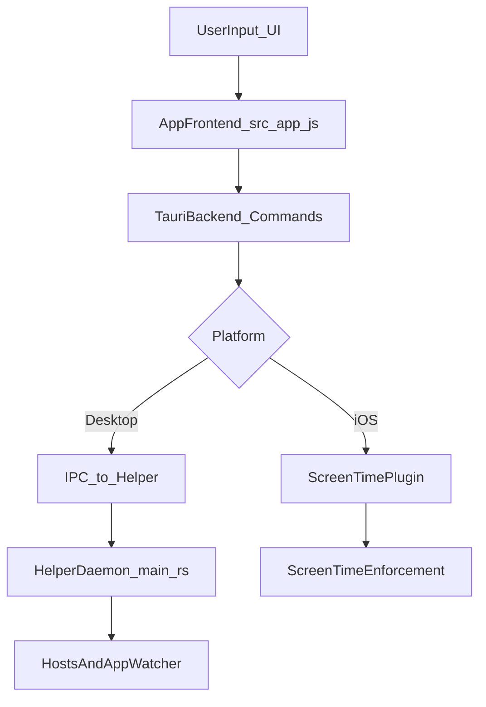
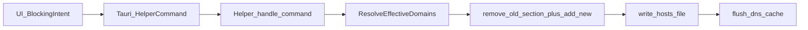
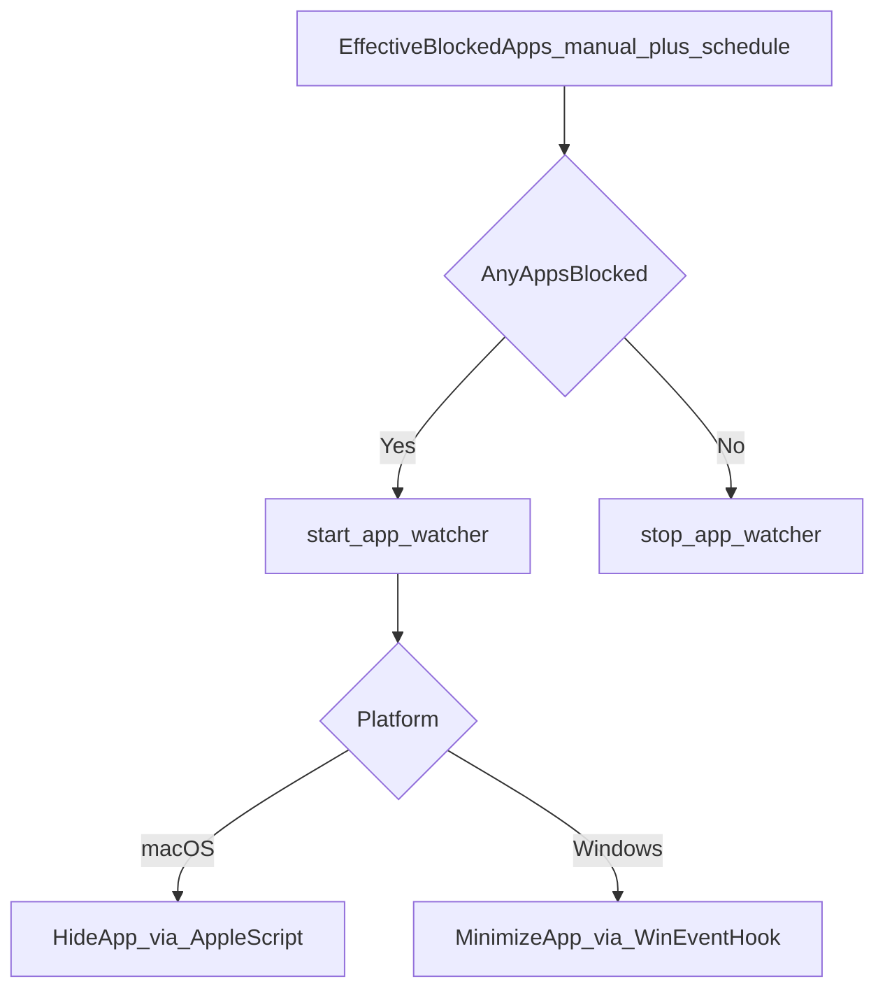
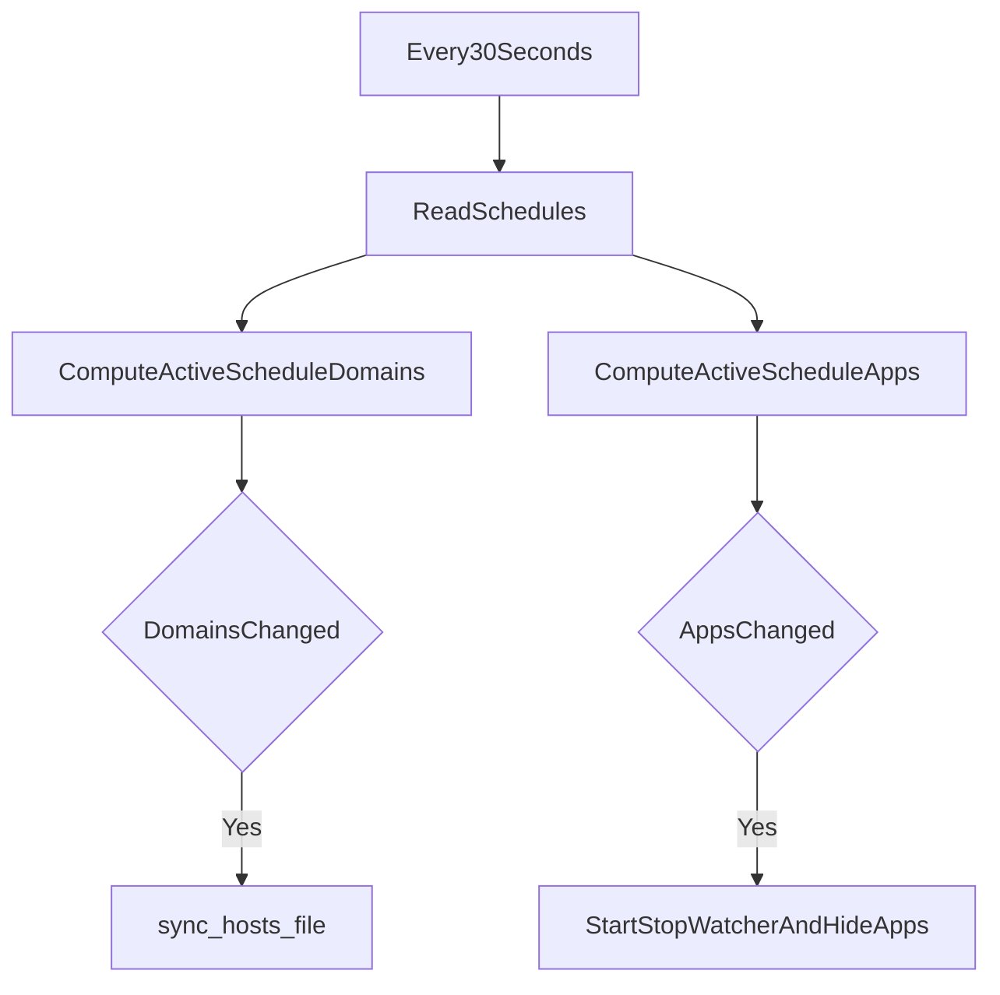
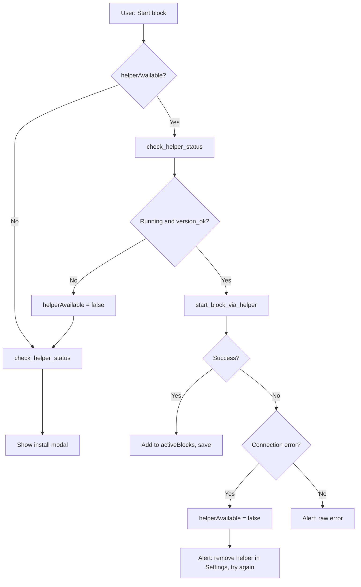
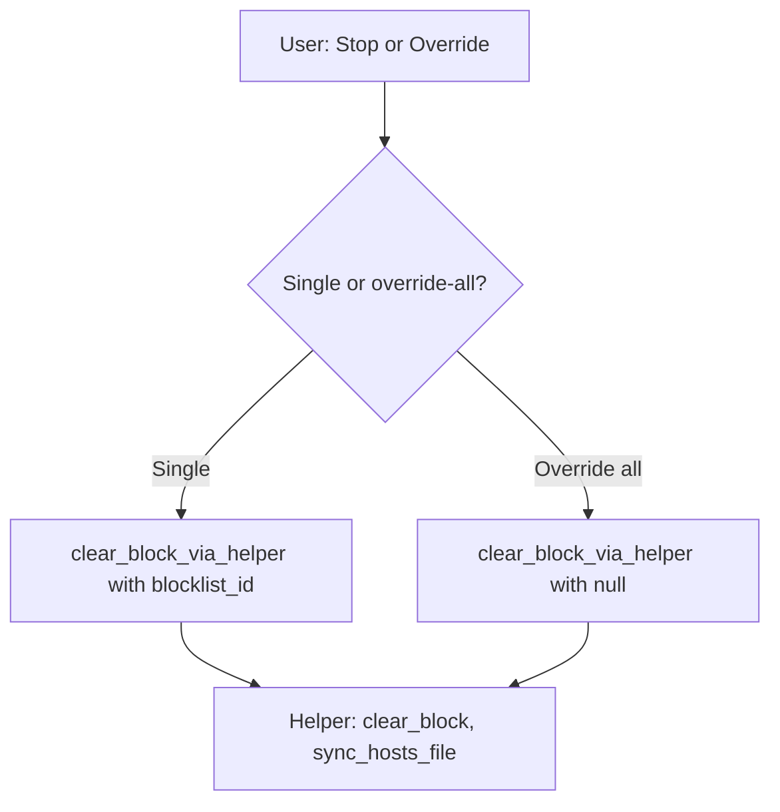
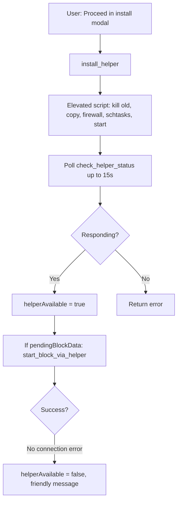
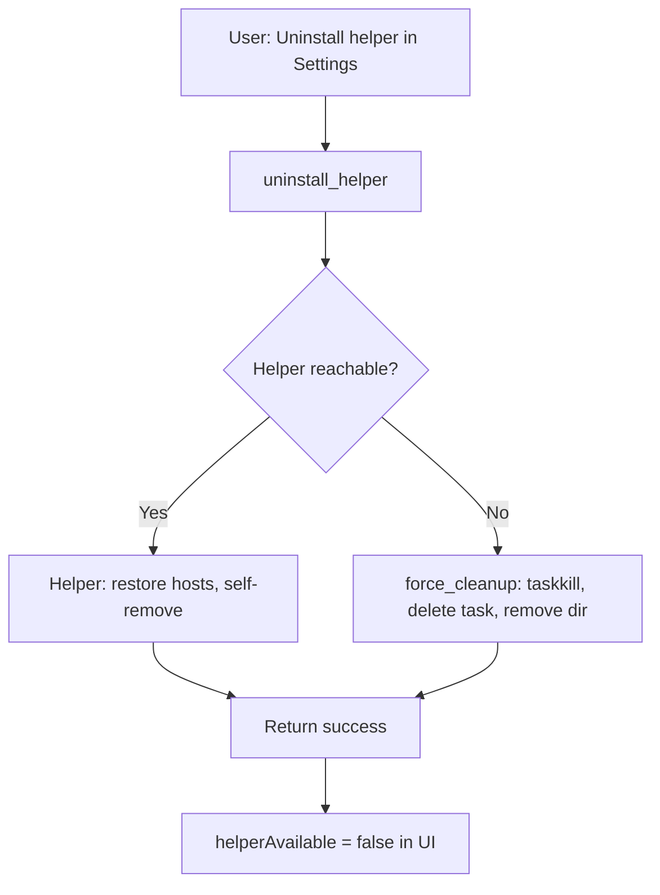
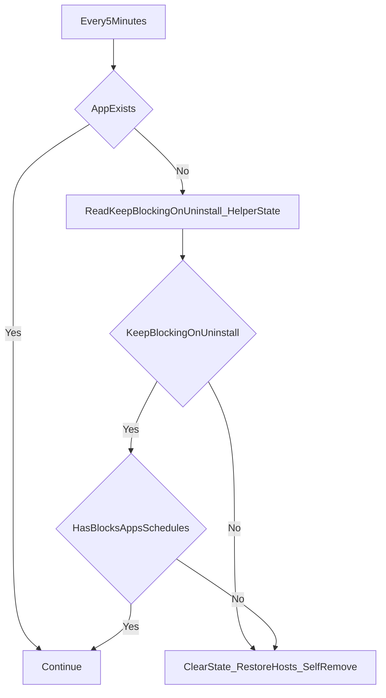

# ReDD Block Architecture Reference (macOS, Windows, iOS)

This is the technical architecture source-of-truth for contributors.

It is intentionally detailed and implementation-aligned, with file references to actual code paths.

---

## 1) Scope and goals

This document explains:

- core runtime architecture on desktop and iOS,
- state ownership and synchronization rules,
- enforcement pipelines (websites and apps),
- lifecycle flows (start, schedule, override, uninstall, cleanup),
- override difficulty configuration (including max difficulty mode) and blocklist duplication,
- cross-platform differences,
- a plain-language exhaustive functionality catalog.

Primary code surfaces:

- `src/app.js` (frontend orchestration and UX state)
- `src-tauri/src/commands/data.rs` (app data persistence)
- `src-tauri/src/commands/helper.rs` (desktop helper bridge and lifecycle commands)
- `src-tauri/src/commands/apps.rs` (desktop app picker utilities)
- `src-tauri/src/lib.rs` (command registration and platform window setup)
- `helper-daemon/src/main.rs` (desktop privileged enforcement engine)
- `tauri-plugin-screentime/` (iOS blocking plugin stack)

---

## 2) Runtime architecture at a glance

There are two enforcement families:

- **Desktop (macOS/Windows):** helper daemon is the privileged enforcement runtime.
- **iOS:** Screen Time plugin/API is the enforcement runtime.

---

## 3) State ownership and authority model

## 3.1 App-owned state (authoring and UX)

Persisted via `src-tauri/src/commands/data.rs`:

- `blocklists`
- `activeBlocks`
- `schedules`
- `settings`

Used by `src/app.js` for:

- rendering,
- challenge UX,
- local schedule/block computations,
- command dispatching.

## 3.2 Helper-owned state (desktop enforcement authority)

Persisted via `helper-daemon/src/main.rs` (`helper-state.json`):

- `manual_blocks`
- `blocked_apps`
- `schedules`
- `keepBlockingOnUninstall`

This state is authoritative for desktop enforcement decisions and merging behavior.

## 3.3 iOS enforcement state

iOS does not use helper/hosts. Enforcement is delegated to Screen Time API through plugin calls from `src/app.js` (`plugin:screentime|...` commands).

---

## 4) Desktop helper internals

Core constants and command model in `helper-daemon/src/main.rs`:

- hosts markers:
  - `# === BEGIN REDD BLOCK (reddfocus.org) ===`
  - `# === END REDD BLOCK (reddfocus.org) ===`
- hosts path:
  - macOS: `/etc/hosts`
  - Windows: `C:\Windows\System32\drivers\etc\hosts`
- IPC command enum includes:
  - `start-block`, `clear-block`, `set-schedules`, `set-blocked-apps`,
  - `set-keep-blocking-on-uninstall`, `restore-hosts`, `uninstall`, `ping`, `get-version`, `get-status`.

---

## 5) Website blocking pipeline (desktop, technical)

## 5.1 End-to-end command path

For desktop, website enforcement always goes through helper:

1. `src/app.js` computes current desired blocked-domain state.
2. Tauri commands in `src-tauri/src/commands/helper.rs` send JSON IPC (`start-block`, `clear-block`, `set-schedules`, `restore-hosts`).
3. Helper `handle_command()` (`helper-daemon/src/main.rs`) updates authoritative state.
4. Helper calls `sync_hosts_file()` to rebuild effective domains and write hosts.
5. Helper calls `flush_dns_cache()`.

## 5.2 Hosts transformation internals

Helper hosts functions in `helper-daemon/src/main.rs`:

- `remove_block_from_hosts(content)`:
  - removes the managed section between
    - `# === BEGIN REDD BLOCK (reddfocus.org) ===`
    - `# === END REDD BLOCK (reddfocus.org) ===`
  - also strips legacy markers (`# ReDD Block Start/End`).

- `add_block_to_hosts(content, domains)`:
  - first calls `remove_block_from_hosts` (replace-not-append semantics),
  - sanitizes each domain:
    - strips `https://`/`http://`,
    - strips URL paths,
    - lowercases,
  - skips protected domains via `is_protected_domain`,
  - writes both IPv4 and IPv6 entries:
    - `0.0.0.0 domain`, `0.0.0.0 www.domain`,
    - `:: domain`, `:: www.domain`.

- `sync_hosts_file(state, schedule_state)`:
  - computes union set from active manual blocks and active schedule domains,
  - deduplicates via set semantics,
  - writes final rendered hosts content.

## 5.3 Write safety and rollback mechanics

`write_hosts_file(content)` enforces multiple hard safety checks:

- refuses writes that omit `localhost` entry,
- on unsafe content:
  - attempts `restore_hosts_from_backup()`,
  - if restore fails, writes a minimal valid hosts file as last resort.

Backup mechanics:

- `ensure_backup_exists()` creates `hosts.redd-backup` on first write,
- backup is cleaned of managed block entries before saving,
- `restore_hosts_from_backup()` validates backup still contains `localhost`.

## 5.4 Platform-specific write strategy

- **Windows**:
  - direct write with `fs::write(HOSTS_PATH, content)`,
  - avoids rename approach due to common lock contention from AV/DNS services.

- **macOS**:
  - atomic-leaning approach: write temp file then `rename`,
  - direct-write fallback if rename fails.

## 5.5 DNS flush internals

`flush_dns_cache()` does per-OS commands:

- macOS:
  - `dscacheutil -flushcache`
  - `killall -HUP mDNSResponder`
- Windows:
  - `ipconfig /flushdns` with hidden-window creation flags.

This ensures OS resolver sees hosts changes quickly (browser cache may still delay visible behavior).

## 5.6 Domain normalization and protection

Both frontend and helper enforce protections:

- frontend:
  - `PROTECTED_DOMAINS` in `src/app.js`,
  - `isProtectedDomain()`.
- helper:
  - protected-domain filter before hosts rendering.

This defense-in-depth prevents accidental self-breakage if UI validation is bypassed.

---

## 6) App blocking watcher pipeline (desktop, technical)

App blocking is helper-owned and independent of hosts writes.

## 6.1 Watcher lifecycle and state transitions

In `helper-daemon/src/main.rs`:

- `set_blocked_apps(...)` updates manual blocked app list.
- schedule evaluator computes schedule-active apps.
- effective blocked apps are union of manual + schedule sources.
- `start_app_watcher()` starts background watcher if needed.
- `stop_app_watcher()` tears down watcher when no effective apps remain.

Watcher stop details:

- Windows posts `WM_QUIT` to watcher thread message loop.
- macOS kills the watcher subprocess/script and cleans temp script file.

## 6.2 macOS watcher internals

`run_macos_app_watcher(...)`:

- writes a temporary AppleScript that subscribes to:
  - `NSWorkspaceDidLaunchApplicationNotification`,
  - `NSWorkspaceDidActivateApplicationNotification`.
- runs via `osascript`, reading emitted app names from stderr log output.
- matches app names case-insensitively against blocked set.
- debounces repeat detections (~500ms window via `last_detection` map).
- calls `hide_app(app_name)` which executes AppleScript visibility hide.
- includes a macOS-only periodic foreground fallback check thread (2s cadence):
  - reads current frontmost app name,
  - applies same blocked-app matching and debounce rules,
  - calls `hide_app(...)` when event-driven watcher misses focus transitions.

## 6.3 Windows watcher internals

`run_windows_app_watcher(...)`:

- installs WinEvent hook (`SetWinEventHook`) for:
  - `EVENT_SYSTEM_FOREGROUND`,
  - `EVENT_SYSTEM_MINIMIZEEND`.
- runs native message loop (`GetMessageW`, `TranslateMessage`, `DispatchMessageW`).
- callback resolves process image name from `hwnd`,
  normalizes executable name, and compares against effective blocked-app set.
- blocked app windows are minimized via `ShowWindow(..., SW_FORCEMINIMIZE)`.

Windows performance path:

- effective blocked apps are stored in shared `RwLock<Arc<Vec<String>>>` state (`EFFECTIVE_BLOCKED_APPS`),
- callback reads cloned app lists with low contention and safer lifetime semantics.

## 6.4 App protection rules

Protected apps are filtered in frontend and helper:

- `PROTECTED_APP_NAMES` in `src/app.js`,
- helper-side protected-app checks.

Goal: never hide/minimize ReDD Block itself.

## 6.5 App blocking persistence caveat

Desktop watcher persistence is robust while helper is alive, but timing semantics differ by source:

- schedule app activation/deactivation is helper-evaluated (30s cadence),
- manual app blocking state is persisted helper-side,
- one-off app-block expiry interactions still depend on how app-side intent and helper state stay synchronized over time.

---

## 7) One-off blocks (manual blocks)

## 7.1 Data model

Helper stores manual one-off blocks as `manual_blocks` with:

- domains,
- end_time,
- blocklist_id.

## 7.2 Runtime behavior

- Start path adds/updates manual block state and triggers hosts sync.
- Expiry path runs in helper `expiry_checker()` loop (1s cadence).
- Expired manual blocks are removed by time and persisted.

This gives near-real-time end behavior for website enforcement without requiring app UI to stay open.

Technical details:

- start command path:
  - frontend `updateHostsFile()` / block start flow in `src/app.js`,
  - Tauri `start_block_via_helper(...)`,
  - helper `IpcCommand::StartBlock` -> `start_block(...)`.
- clear path:
  - scoped clear by blocklist identity uses `clear_block_via_helper(blocklist_id)`,
  - helper `clear_block(...)` mutates only targeted manual block(s),
  - resulting domain set is recomputed through `sync_hosts_file(...)`.
- expiry loop behavior:
  - `expiry_checker()` runs every second,
  - retains only blocks with `end_time > now`,
  - on change, triggers hosts sync + state persist.

## 7.3 Pause/resume architecture (one-off + schedule)

Pause semantics are stateful and enforcement-driven, not UI-only.

- one-off pause state lives in app data (`src/app.js`): `isPaused`, `pauseEndTime` on active blocks.
- schedule pause state is synchronized end-to-end:
  - frontend schedule records include pause fields,
  - `syncSchedulesToHelper()` sends `isPaused` + `pauseEndTime`,
  - helper schedule records persist the same fields.

Enforcement behavior:

- while paused:
  - domains/apps from paused one-off and paused schedule sources are excluded from effective blocking sets,
  - helper schedule evaluation explicitly skips paused schedules.
- on manual resume or natural pause expiry:
  - pause fields are cleared,
  - app re-syncs helper schedule/manual block state,
  - hosts and app watcher state are recomputed and re-applied.

Schedule pause can be triggered even when no segment is currently active; this suppresses upcoming segment activation until pause end or manual resume.

---

## 8) Scheduled blocks

## 8.1 Schedule representation

Helper schedule records include:

- `id`, `domains`, `apps`,
- `isPaused`, `pauseEndTime`,
- segment list with start/end hour/minute and day set.

## 8.2 Evaluator loop

`schedule_evaluator()` in helper runs every 30s:

- computes active schedule domains/apps from local time,
- skips schedules paused at current time (`isPaused && pauseEndTime > now`),
- compares with previous active set,
- applies transitions:
  - hosts sync when active domains changed,
  - watcher/app updates when active apps changed.

## 8.3 Future schedule activation

On desktop, helper can activate future schedule windows without app UI running, because schedule evaluation is helper-local and persistent.

---

## 9) Merge semantics and overlap correctness

Effective desktop enforcement is a composition of:

- manual one-off blocks,
- currently active schedule windows.

Consequences:

- shared domains remain blocked while any source is active,
- one block override does not collapse unrelated overlapping rules,
- one-off and schedule on same blocklist compose safely.

This is a key correctness property for concurrent blocking scenarios.

---

## 10) Override architecture

Frontend handles challenge UX (`src/app.js`) and dispatches scoped clear commands to helper.

Important paths:

- scoped clear uses identity-aware semantics (blocklist/target-specific),
- override-all uses broad clear semantics intentionally,
- helper applies state mutation + resync, preventing UI-only divergence.

This keeps override behavior deterministic in multi-block situations.

### 10.1 Override difficulty configuration and max difficulty mode

Override difficulty (friction settings) lives on each blocklist and controls the challenge required to override a block: type (random words, random gibberish, or custom text), character count, and optional **max difficulty** lock.

**Data model** (persisted in `blocklist.overrideDifficulty`):

- `type`: `'random-words'` | `'gibberish'` | `'custom'`
- `count`: number of characters (for random types) or length of custom text
- `maxDifficulty`: boolean — when true, effective challenge is always max for the chosen random type (7500 for random-words, 5000 for gibberish)
- `countBeforeMax`: when `maxDifficulty` is true, stored so unchecking restores this count (avoids defaulting to 50)
- `typeBeforeMax`: when `maxDifficulty` is true, stored so unchecking restores this type (e.g. `'custom'`)
- `customText`: used only when `type === 'custom'`

**Max difficulty behavior:**

- When the user checks “Max difficulty” (checkbox next to the override-type dropdown in Add/Edit Blocklist modal):
  - The dropdown is restricted to Random Words and Random Gibberish (Custom Text option is removed from the DOM and stored in `removedOverrideCustomOptionEl` so it can be re-appended).
  - If the current type was Custom Text, it switches to Random Words.
  - The character count is set and locked to the max for the selected type; the count input is greyed out (same disabled styling as when the blocklist is active) and made non-interactive (`override-count-max-mode`, `form-input-disabled`, `input-suffix-disabled`).
  - Current type and count are stored in memory (`lastOverrideTypeValueBeforeMaxDifficulty`, `lastOverrideCountValueBeforeMaxDifficulty`) and on save as `typeBeforeMax` and `countBeforeMax`.
- When the user unchecks:
  - Custom Text is re-added to the dropdown; dropdown and count are restored to `typeBeforeMax` and `countBeforeMax`.
- Only the checkbox toggles max difficulty; the “Max difficulty” label is non-clickable (div, not label) and shows a text cursor. When the blocklist is active, the max difficulty checkbox is disabled like the other override inputs (`max-difficulty-disabled`).

**Code locations:**

- UI: `src/index.html` — Override Difficulty form group, `.override-type-row`, `#override-max-difficulty-checkbox`, `#override-max-difficulty-label`
- Styles: `src/styles.css` — `.override-type-row`, `.override-type-select` (narrower), `.max-difficulty-checkbox-option`, `.override-count-max-mode`, `.override-count-max-mode .form-input.form-input-disabled` (border preserved to avoid layout jump), `.max-difficulty-disabled`
- Logic: `src/app.js` — state (`lastOverrideCountValueBeforeMaxDifficulty`, `lastOverrideTypeValueBeforeMaxDifficulty`, `removedOverrideCustomOptionEl`), `ensureOverrideCustomOptionPresent()`, `removeOverrideCustomOption()`, checkbox and override-type change handlers, save/load/duplicate/close-modal handling, `getMaxOverrideCharsForType()`
- i18n: `overrideMaxDifficulty` in app.js strings and `setText('override-max-difficulty-label', ...)`

**Persistence and duplication:**

- On save with max difficulty checked, `count` is set to the max for the type and `countBeforeMax` / `typeBeforeMax` are persisted so reopen and uncheck restores the previous value (e.g. 20) and type (e.g. custom).
- On duplicate, `overrideDifficulty` is copied including `maxDifficulty`, `countBeforeMax`, and `typeBeforeMax`, so the duplicate inherits max difficulty and restore behavior.

### 10.2 Blocklist duplication

Blocklist duplication creates a full copy of a blocklist (and its schedule if present) with a new id and a derived name; the duplicate is never active.

**Entry point:** `duplicateBlocklist(id)` in `src/app.js`.

**What is copied:**

- **Blocklist:** `id` (new UUID), `name` (via `getNextCopyName(blocklist)`), `mode`, `color`, `emoji`, `websites`, `apps`, `showItemDetails`, `alwaysShowInSchedule`, `overrideDifficulty` (full object: `type`, `count`, `maxDifficulty`, `countBeforeMax`, `typeBeforeMax`, `customText` when applicable).
- **Schedule (if any):** New schedule id and `blocklistId` pointing at the new blocklist; segments, `repeatType`, `repeatDate` copied. No blocks are started for the duplicate.

**Naming semantics:**

- Implemented in `getNextCopyName(blocklist)`, `parseCopyRoot(name)`, `nameInChain(name, root)`, `sameBlocklistContent(idA, idB)` (`contentKey(blocklistId)`), in `src/app.js`.
- macOS-style naming: “X” → “X copy”, then “X copy 2”, “X copy 3”, … with gap-fill when copies are deleted. If the user renames a copy, the next duplicate of the original still uses the same chain; if they edit the duplicate’s content, it is treated as a new chain for naming.
- Content-based chain: duplicates that share the same content (websites, apps, override config, schedule) reuse the same copy-number chain; if content differs, the name is treated as a new base.

**Post-duplicate UX:** Selection remains on the original blocklist so the user can duplicate again without changing selection; dropdown is updated to reflect the new list.

---

## 11) Helper lifecycle and versioning (desktop)

## 11.1 Install/update

`src-tauri/src/commands/helper.rs` handles:

- helper status checks,
- install path and elevation flow,
- version compatibility checks via `EXPECTED_HELPER_VERSION` (currently `0.8.5`),
- reinstall/update when helper is outdated.

Before starting a block, the frontend (`src/app.js`) re-verifies helper availability when it believes the helper is available (via `check_helper_status`). This avoids using a stale “helper available” state (e.g. on Windows, where the helper is not restarted on crash). If a start-block attempt fails with a helper connection error (e.g. connection refused on Windows, os error 10061), the app clears the cached availability flag and shows a message directing the user to remove the helper in Settings and try again to reinstall, so the next Start block shows the install modal instead of repeating the raw error.

## 11.2 Runtime persistence

- macOS: launch daemon registration and privileged helper path.
- Windows: scheduled task setup and elevated helper execution path.

## 11.3 Manual helper uninstall

Uninstall command path:

- attempt graceful helper `uninstall` command,
- fallback to force cleanup path if needed.

## 11.4 Desktop helper: full UI-to-helper flow (start, stop, override, install, uninstall)

The flows below show the frontend (`src/app.js`), Tauri (`helper.rs`), and helper daemon (TCP 127.0.0.1:62222 on Windows, Unix socket on macOS). They reflect post-fix behavior: re-verify before start block when `helperAvailable` is true, and clear the cached flag plus a friendly message on connection failure.

*If diagrams render with low contrast, view this file on GitHub or in a Mermaid preview (e.g. VS Code Mermaid extension) for better visibility.*

**Start block (desktop)**

**Stop block / Override**

**Helper install**

**Helper uninstall**

**Ongoing sync to helper** (called from various flows): `set_schedules_via_helper`, `set_blocked_apps_via_helper`, `set_keep_blocking_on_uninstall_via_helper`.

- **Start block:** If we believe the helper is available we re-verify with `check_helper_status`; if that fails we set `helperAvailable = false` and show the install modal. If we then call `start_block_via_helper` and it fails with a connection error, we clear the flag and show the friendly “remove helper in Settings” message so the next attempt shows the modal.
- **Stop / Override:** Scoped clear sends `blocklist_id`; override-all sends `blocklist_id: None`. Helper updates `manual_blocks` and runs `sync_hosts_file`.
- **Install:** Elevated script installs and starts the helper; frontend polls until ping succeeds then sets `helperAvailable = true` and may start the pending block (with same connection-error handling).
- **Uninstall:** Frontend sends uninstall command; if helper is unreachable the backend runs force_cleanup and still returns success; frontend sets `helperAvailable = false`.

---

## 12) App close vs app uninstall semantics (desktop)

## 12.1 App close

Closing app window does not stop helper runtime. Helper loops continue:

- expiry,
- schedule evaluation,
- app watcher.

## 12.2 App uninstall/removal

Helper `app_existence_checker()` (5-minute cadence) decides cleanup based on:

- app presence,
- `keepBlockingOnUninstall` (helper-owned preference),
- whether active/configured enforcement state exists.

Implementation specifics (`helper-daemon/src/main.rs`):

- `check_app_exists()` probes platform install locations:
  - macOS: `/Applications/ReDD Block.app`, `~/Applications/ReDD Block.app`
  - Windows: `%LOCALAPPDATA%\Programs\redd-block\ReDD Block.exe`,
    `%PROGRAMFILES%\ReDD Block\ReDD Block.exe`
- preference read path:
  - primary: helper state (`read_keep_blocking_preference_from_helper_state`)
  - compatibility fallback: app data read path (`read_user_setting_keep_blocking_from_app_data`)
- active-manual check uses time-based predicate (`end_time > now`), not simple non-empty check.

Cleanup path includes:

- clearing in-memory state,
- persisting empty helper state,
- restoring hosts,
- deleting helper state file,
- self-removal from OS startup mechanism.

Self-removal internals:

- `perform_self_cleanup()` executes platform-specific teardown:
  - macOS: launchd removal + plist/socket cleanup,
  - Windows: scheduled task removal + helper directory cleanup.

---

## 13) iOS architecture specifics

iOS uses Screen Time plugin commands from `src/app.js`:

- authorization check/request,
- website blocking commands,
- app/category selection via activity picker,
- clearing/unblocking path.

Key distinction: there is no desktop helper engine on iOS; behavior and limitations follow Screen Time platform semantics.

---

## 14) Data paths and persistence locations

## 14.1 App data

- macOS: `~/Library/Application Support/com.redd.block/redd-block-data.json`
- Windows: `%APPDATA%\com.redd.block\redd-block-data.json`
- iOS: Tauri-managed app sandbox path

## 14.2 Helper data (desktop only)

- macOS: `/var/lib/redd-block/helper-state.json`
- Windows: `%PROGRAMDATA%\ReDD Block\helper-state.json`

## 14.3 Hosts backup (desktop only)

- macOS: `/etc/hosts.redd-backup`
- Windows: `C:\Windows\System32\drivers\etc\hosts.redd-backup`

---

## 15) Safety and security mechanisms

- protected domain filtering (frontend + helper),
- protected app filtering (frontend + helper),
- hosts backup/restore safety net,
- localhost validity checks before/after writes,
- constrained privileged operations in helper lifecycle paths,
- compatibility defaults for missing fields/version drift paths.

These reduce risk of system networking breakage and self-lockout.

---

## 16) Known technical constraints and non-obvious behaviors

- schedule transitions are loop-driven (not edge-triggered interrupts), so boundary effects are interval-bounded,
- browser-level caching can delay visible effect after hosts changes even when helper completed correctly,
- helper upgrade mismatch can disable helper-available paths until reinstall/update,
- on Windows, the helper process is not restarted on crash (scheduled task runs at logon only); if the helper exits, the app re-verifies before start block and on connection failure clears cached availability and shows instructions to remove then reinstall the helper,
- desktop app-block timing still depends on effective blocked-app state transitions, not hosts model,
- iOS behavior differs by API constraints and authorization state.

---

## 17) Plain-language exhaustive functionality catalog

This section is intentionally non-technical and complete.

### 17.1 Blocklist authoring and management

- create, rename, recolor, decorate (emoji) blocklists,
- add/remove website targets,
- add/remove app targets,
- configure override challenge difficulty (random words, random gibberish, or custom text; character count),
- **max difficulty mode:** optional checkbox that locks override to the hardest setting (max characters for random words or gibberish); when unchecked, restores the previous type and count (including custom text),
- **duplicate blocklist:** full copy with a new name in the “X copy” / “X copy 2” chain; copies override settings (including max difficulty and restore state), schedule if present, and other blocklist properties; duplicate is never started automatically,
- delete blocklists with cleanup behavior.

### 17.2 One-off block behavior

- start immediate focus block,
- choose timed or always-on mode,
- block ends naturally when timer expires,
- pause and resume paths (manual or natural pause expiry),
- paused one-off blocks remove their domains/apps from enforcement until resumed,
- single-block override and override-all behavior.

### 17.3 Scheduled block behavior

- create schedules by day/time segments,
- support active-now and future windows,
- support recurring/date-based semantics,
- support cross-midnight schedule segments,
- support pause/resume even when currently inactive (suppresses upcoming segment activation while paused),
- schedule transitions happen automatically in background.

### 17.4 Combined and concurrent behavior

- multiple blocklists active simultaneously,
- one-off + schedule overlap,
- shared-domain correctness while overlaps exist,
- overriding one target should not incorrectly clear unrelated targets.

### 17.5 App blocking behavior

- blocked apps are hidden/minimized when launched or focused (desktop),
- app blocking can continue while app UI is closed (desktop helper running),
- self-protection prevents ReDD Block from blocking itself.

### 17.6 Website blocking behavior

- blocked domains are redirected via system-level mechanism,
- behavior applies across browsers on desktop via hosts model,
- clean-hosts recovery path exists for stale entries.

### 17.7 Helper lifecycle and controls

- install helper (with elevation),
- auto-check helper version compatibility,
- update helper when outdated,
- uninstall helper now from settings,
- helper background persistence after setup.
- if the helper is unreachable when starting a block (e.g. connection refused on Windows), the app clears cached “helper available” state and shows instructions to remove the helper in Settings and try again to reinstall, avoiding repeated raw connection errors.

### 17.8 Uninstall and persistence behavior

- if app is closed: desktop blocking can continue,
- if app is uninstalled and preserve is ON: helper can continue based on active/configured rules,
- if app is uninstalled and preserve is OFF: helper performs cleanup and self-removal.

### 17.9 iOS-specific behavior

- website/app restrictions are managed through Screen Time APIs,
- app/category selection uses iOS picker flows,
- behavior depends on authorization and iOS policy model rather than helper daemon.

### 17.10 User safety and trust

- protected domains/apps are never intentionally blocked,
- hosts safety checks and backups are designed to prevent system breakage,
- architecture is designed to preserve focus behavior while minimizing accidental lockout risk.

---

## 18) Contributor guidance

When implementing new behavior, define explicitly:

1. state owner (app vs helper vs iOS plugin),
2. persistence location,
3. merge semantics with existing block sources,
4. override semantics (scoped vs global),
5. app-close vs app-uninstall behavior,
6. platform divergence handling.

If these are not explicit, regressions in overlap/override/uninstall behavior are likely.

