# ReDD Block Architecture Reference (macOS, Windows, iOS)

> **⚠ Out-of-date for desktop (v1.1.0).** Sections 4–9 below describe
> the old helper-daemon architecture and are kept as historical
> reference while the rewrite lands. Current desktop architecture:
>
> - **macOS 14+** uses the Screen Time plugin for websites; app blocking
>   runs in-process via `src-tauri/src/app_watcher.rs`.
> - **Windows** uses the ReDD Focus browser extension + Rust native host
>   (`src-tauri/src/native_host.rs`), with a compliance enforcer loop
>   (`src-tauri/src/enforcer.rs`) and the same in-process app watcher.
>
> The privileged helper daemon is gone. No hosts-file writes on any
> platform. See `browser-ext-mvp/MIGRATION_PLAN.md` for the rationale
> and migration steps.

This is the technical architecture source-of-truth for ReDD Block.

It is intentionally detailed and implementation-aligned, with file references to actual code paths.

---

## 1) Scope and goals

This document explains:

- core runtime architecture on desktop and iOS,
- state ownership and synchronization rules,
- enforcement pipelines (websites and apps),
- lifecycle flows (start, schedule, override, uninstall, cleanup),
- override difficulty configuration (including max difficulty mode) and blocklist duplication,
- diagnostics and machine-level support surfaces,
- cross-platform differences.

Primary code surfaces:

- `src/app.js` (frontend orchestration and UX state)
- `src-tauri/src/commands/data.rs` (app data persistence)
- `src-tauri/src/commands/helper.rs` (desktop helper bridge and lifecycle commands)
- `src-tauri/src/commands/apps.rs` (desktop app picker utilities)
- `src-tauri/src/lib.rs` (command registration and platform window setup)
- `helper-daemon/src/main.rs` (desktop privileged enforcement engine)
- `tauri-plugin-screentime/` (iOS blocking plugin stack): `src/commands.rs`, `src/mobile.rs` (Rust bridge), `ios/Sources/ScreentimePlugin.swift` (authorization, ManagedSettings, DeviceActivityCenter, activity picker), `ios/Sources/ScheduleData.swift` and `src-tauri/gen/apple/Shared/ScheduleData.swift` (App Group schedule payload), `src-tauri/gen/apple/ReddBlockMonitor/DeviceActivityMonitorExtension.swift` (DeviceActivityMonitor for scheduled windows).

---

## 2) Runtime architecture at a glance

There are two enforcement families:

- **Desktop (macOS/Windows):** helper daemon is the privileged enforcement runtime.
- **iOS:** Screen Time plugin/API is the enforcement runtime.

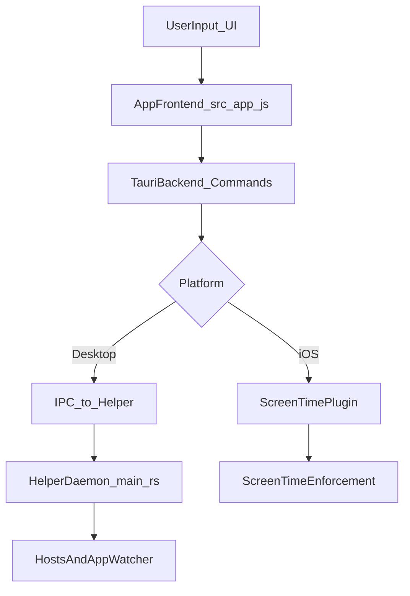

---

## 3) State ownership and authority model

## 3.1 App-owned state (authoring and UX)

Persisted via `src-tauri/src/commands/data.rs`:

- `blocklists`
- `activeBlocks`
- `schedules`
- `settings`

Important `settings` sub-state now includes EULA acceptance:

- `eulaAcceptedRevision`
- `eulaAcceptedAt`

Used by `src/app.js` for:

- rendering,
- challenge UX,
- local schedule/block computations,
- pause/resume state,
- command dispatching,
- onboarding gates (EULA, then iOS Screen Time authorization).

## 3.2 Helper-owned state (desktop enforcement authority)

Persisted via `helper-daemon/src/main.rs` (`helper-state.json`):

- `manual_blocks`
- `blocked_apps`
- `schedules`
- `keepBlockingOnUninstall`

This state is authoritative for desktop enforcement decisions and merging behavior.

## 3.3 iOS enforcement state

iOS does not use helper/hosts. Enforcement is delegated to Screen Time API through plugin calls from `src/app.js` (`plugin:screentime|...` commands).

## 3.4 Desktop app-data authority and path selection

Desktop app data now has both:

- legacy per-user locations, and
- a shared machine-level canonical location.

Current canonical shared app-data paths:

- macOS: `/var/lib/redd-block/redd-block-data.json`
- Windows: `%PROGRAMDATA%\ReDD Block\redd-block-data.json`

Legacy per-user app-data paths:

- macOS: `~/Library/Application Support/com.redd.block/redd-block-data.json`
- Windows: `%APPDATA%\com.redd.block\redd-block-data.json`

Canonical path selection in `src-tauri/src/commands/data.rs` is based on:

- whether shared app data already exists,
- whether shared helper state already exists,
- whether the shared directory is writable.

Once the shared location becomes active, the app continues to prefer it so uninstall/reinstall flows do not silently flip storage location.

EULA acceptance is stored in the same canonical app-data file as the rest of app-owned state. This means:

- desktop EULA acceptance persists across normal updates and reinstall-overwrites as long as the canonical app-data file remains
- EULA acceptance does **not** live in helper state
- helper uninstall/reinstall is not the source of truth for EULA completion

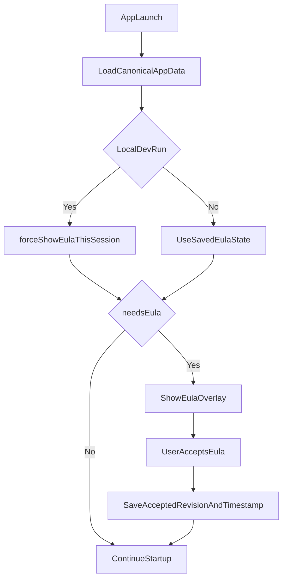

## 3.5 EULA state model and migration

The app uses a revision-based EULA model:

- `CURRENT_EULA_REVISION` is defined in `src/app.js`
- the user is considered compliant when saved `eulaAcceptedRevision === CURRENT_EULA_REVISION`
- local dev force-shows the EULA via runtime override rather than by deleting persisted acceptance

Migration rules:

- legacy installs with `eulaAccepted: true` are promoted to `eulaAcceptedRevision = 1`
- if legacy `eulaAcceptedAt` exists, it is copied forward
- normal app upgrades do not re-prompt users unless `CURRENT_EULA_REVISION` changes

This separates three independent concepts:

- app version
- helper daemon version
- legal revision

Only the legal revision should control whether the EULA is shown again.

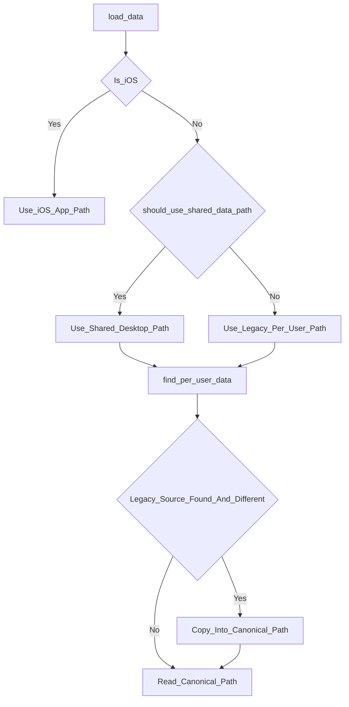

---

## 4) Desktop helper internals

Core constants and command model in `helper-daemon/src/main.rs`:

- hosts markers:
  - `# === BEGIN REDD BLOCK (reddfocus.org) ===`
  - `# === END REDD BLOCK (reddfocus.org) ===`
- hosts path:
  - macOS: `/etc/hosts`
  - Windows: `C:\Windows\System32\drivers\etc\hosts`
- IPC command enum includes:
  - `start-block`, `clear-block`, `set-schedules`, `set-blocked-apps`,
  - `set-keep-blocking-on-uninstall`, `restore-hosts`, `uninstall`, `ping`, `get-version`, `get-status`.

---

## 5) Website blocking pipeline (desktop, technical)

## 5.1 End-to-end command path

For desktop, website enforcement prefers the helper path whenever the helper is ready:

1. `src/app.js` computes current desired blocked-domain state.
2. Tauri commands in `src-tauri/src/commands/helper.rs` send JSON IPC (`start-block`, `clear-block`, `set-schedules`, `restore-hosts`).
3. Helper `handle_command()` (`helper-daemon/src/main.rs`) updates authoritative state.
4. Helper calls `sync_hosts_file()` to rebuild effective domains and write hosts.
5. Helper calls `flush_dns_cache()`.

If the helper is not ready, desktop can still use fallback paths in limited cases, but helper-owned enforcement is the preferred architecture.

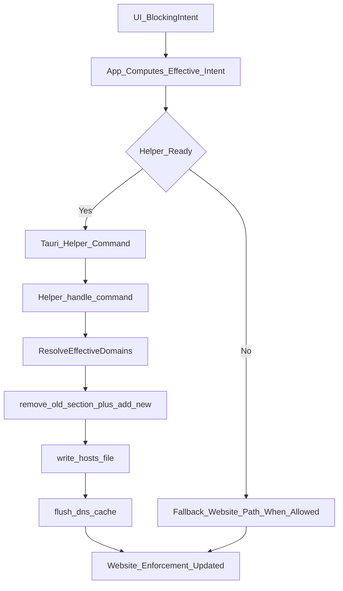

## 5.2 Hosts transformation internals

Helper hosts functions in `helper-daemon/src/main.rs`:

- `remove_block_from_hosts(content)`:
  - removes the managed section between
    - `# === BEGIN REDD BLOCK (reddfocus.org) ===`
    - `# === END REDD BLOCK (reddfocus.org) ===`
  - also strips legacy markers (`# ReDD Block Start/End`).

- `add_block_to_hosts(content, domains)`:
  - first calls `remove_block_from_hosts` (replace-not-append semantics),
  - sanitizes each domain:
    - strips `https://`/`http://`,
    - strips URL paths,
    - lowercases,
  - skips protected domains via `is_protected_domain`,
  - writes both IPv4 and IPv6 entries:
    - `0.0.0.0 domain`, `0.0.0.0 www.domain`,
    - `:: domain`, `:: www.domain`.

- `sync_hosts_file(state, schedule_state)`:
  - computes union set from active manual blocks and active schedule domains,
  - deduplicates via set semantics,
  - writes final rendered hosts content.

## 5.3 Write safety and rollback mechanics

`write_hosts_file(content)` enforces multiple hard safety checks:

- refuses writes that omit `localhost` entry,
- on unsafe content:
  - attempts `restore_hosts_from_backup()`,
  - if restore fails, writes a minimal valid hosts file as last resort.

Backup mechanics:

- `ensure_backup_exists()` creates `hosts.redd-backup` on first write,
- backup is cleaned of managed block entries before saving,
- `restore_hosts_from_backup()` validates backup still contains `localhost`.

## 5.4 Platform-specific write strategy

- **Windows**:
  - direct write with `fs::write(HOSTS_PATH, content)`,
  - avoids rename approach due to common lock contention from AV/DNS services.

- **macOS**:
  - atomic-leaning approach: write temp file then `rename`,
  - direct-write fallback if rename fails.

## 5.5 DNS flush internals

`flush_dns_cache()` does per-OS commands:

- macOS:
  - `dscacheutil -flushcache`
  - `killall -HUP mDNSResponder`
- Windows:
  - `ipconfig /flushdns` with hidden-window creation flags.

This ensures OS resolver sees hosts changes quickly (browser cache may still delay visible behavior).

## 5.6 Domain normalization and protection

Both frontend and helper enforce protections:

- frontend:
  - `PROTECTED_DOMAINS` in `src/app.js`,
  - `isProtectedDomain()`.
- helper:
  - protected-domain filter before hosts rendering.

This defense-in-depth prevents accidental self-breakage if UI validation is bypassed.

---

## 6) App blocking watcher pipeline (desktop, technical)

App blocking is helper-owned and independent of hosts writes.

## 6.1 Watcher lifecycle and state transitions

In `helper-daemon/src/main.rs`:

- `set_blocked_apps(...)` updates manual blocked app list.
- schedule evaluator computes schedule-active apps.
- effective blocked apps are union of manual + schedule sources.
- `start_app_watcher()` starts background watcher if needed.
- `stop_app_watcher()` tears down watcher when no effective apps remain.

Watcher stop details:

- Windows posts `WM_QUIT` to watcher thread message loop.
- macOS kills the watcher subprocess/script and cleans temp script file.

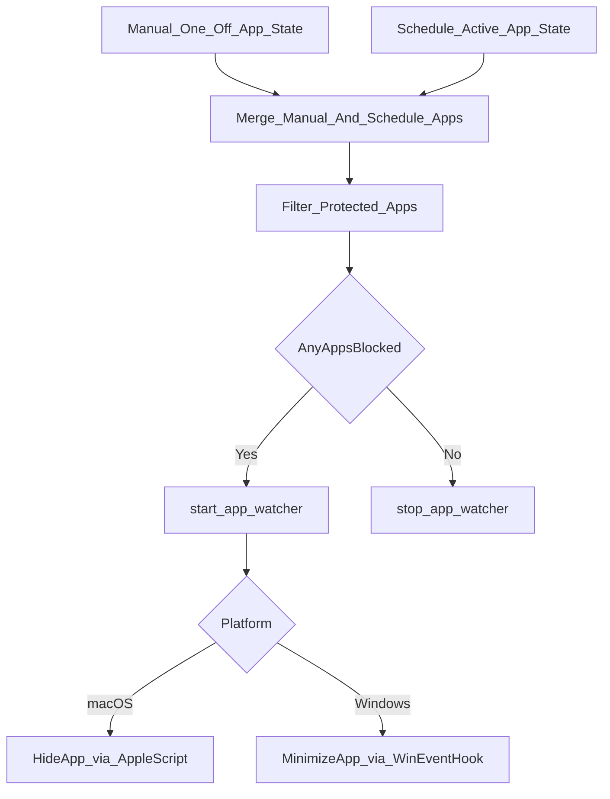

## 6.2 macOS watcher internals

`run_macos_app_watcher(...)`:

- writes a temporary AppleScript that subscribes to:
  - `NSWorkspaceDidLaunchApplicationNotification`,
  - `NSWorkspaceDidActivateApplicationNotification`.
- runs via `osascript`, reading emitted app names from stderr log output.
- matches app names case-insensitively against blocked set.
- debounces repeat detections (~500ms window via `last_detection` map).
- calls `hide_app(app_name)` which executes AppleScript visibility hide.
- includes a macOS-only periodic foreground fallback check thread (2s cadence):
  - reads current frontmost app name,
  - applies same blocked-app matching and debounce rules,
  - calls `hide_app(...)` when event-driven watcher misses focus transitions.

## 6.3 Windows watcher internals

`run_windows_app_watcher(...)`:

- installs WinEvent hook (`SetWinEventHook`) for:
  - `EVENT_SYSTEM_FOREGROUND`,
  - `EVENT_SYSTEM_MINIMIZEEND`.
- runs native message loop (`GetMessageW`, `TranslateMessage`, `DispatchMessageW`).
- callback resolves process image name from `hwnd`,
  normalizes executable name, and compares against effective blocked-app set.
- blocked app windows are minimized via `ShowWindow(..., SW_FORCEMINIMIZE)`.

Windows performance path:

- effective blocked apps are stored in shared `RwLock<Arc<Vec<String>>>` state (`EFFECTIVE_BLOCKED_APPS`),
- callback reads cloned app lists with low contention and safer lifetime semantics.

## 6.4 App protection rules

Protected apps are filtered in frontend and helper:

- `PROTECTED_APP_NAMES` in `src/app.js`,
- helper-side protected-app checks.

Goal: never hide/minimize ReDD Block itself.

## 6.5 App blocking persistence caveat

Desktop watcher persistence is robust while helper is alive, but timing semantics differ by source:

- schedule app activation/deactivation is helper-evaluated (30s cadence),
- manual app blocking state is persisted helper-side,
- one-off app-block expiry interactions still depend on how app-side intent and helper state stay synchronized over time.

---

## 7) One-off blocks (manual blocks)

## 7.1 Data model

Helper stores manual one-off blocks as `manual_blocks` with:

- domains,
- end_time,
- blocklist_id.

App-owned active blocks carry the UX/runtime state, including pause fields.

## 7.2 Runtime behavior

- Start path adds/updates manual block state and triggers hosts sync.
- Expiry path runs in helper `expiry_checker()` loop (1s cadence).
- Expired manual blocks are removed by time and persisted.

This gives near-real-time end behavior for website enforcement without requiring app UI to stay open.

Technical details:

- start command path:
  - frontend block start / `updateHostsFile()` flow in `src/app.js`,
  - Tauri `start_block_via_helper(...)`,
  - helper `IpcCommand::StartBlock` -> `start_block(...)`.
- clear path:
  - scoped clear by blocklist identity uses `clear_block_via_helper(blocklist_id)`,
  - helper `clear_block(...)` mutates only targeted manual block(s),
  - resulting domain set is recomputed through `sync_hosts_file(...)`.
- expiry loop behavior:
  - `expiry_checker()` runs every second,
  - retains only blocks with `end_time > now`,
  - on change, triggers hosts sync + state persist.

## 7.3 Pause/resume architecture (one-off + schedule)

Pause semantics are stateful and enforcement-driven, not UI-only.

- one-off pause state lives in app data (`src/app.js`): `isPaused`, `pauseEndTime` on active blocks.
- schedule pause state is synchronized end-to-end:
  - frontend schedule records include pause fields,
  - `syncSchedulesToHelper()` sends `isPaused` + `pauseEndTime`,
  - helper schedule records persist the same fields.

Enforcement behavior:

- while paused:
  - domains/apps from paused one-off and paused schedule sources are excluded from effective blocking sets,
  - helper schedule evaluation explicitly skips paused schedules.
- on manual resume or natural pause expiry:
  - pause fields are cleared,
  - app re-syncs helper schedule/manual block state,
  - hosts and app watcher state are recomputed and re-applied.

Schedule pause can be triggered even when no segment is currently active; this suppresses upcoming segment activation until pause end or manual resume.

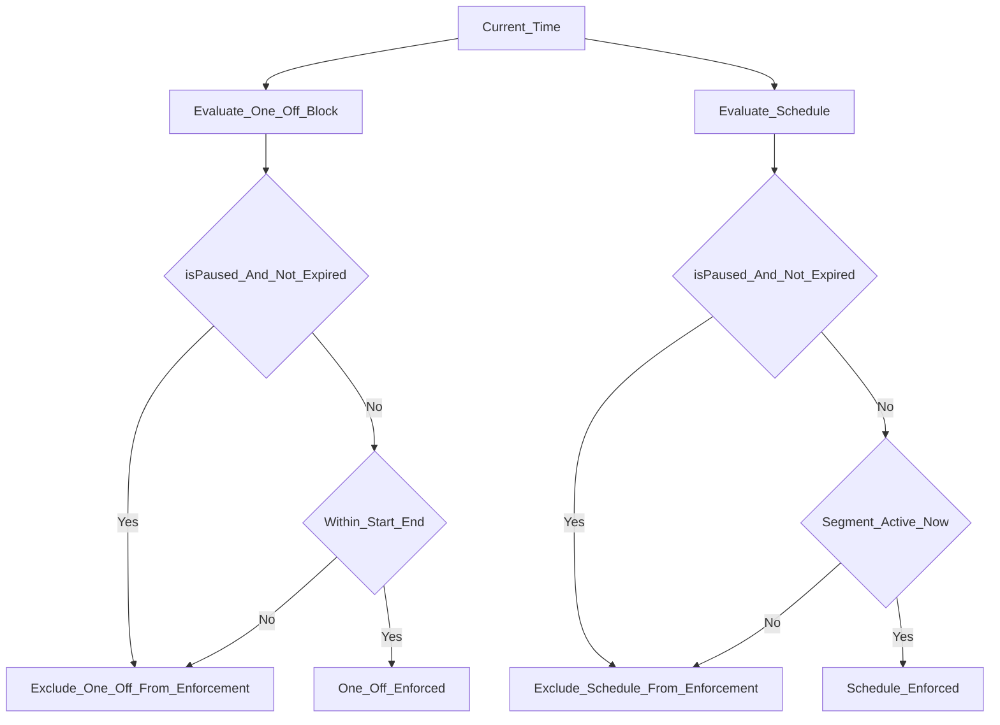

---

## 8) Scheduled blocks

## 8.1 Schedule representation

Helper schedule records include:

- `id`, `domains`, `apps`,
- `isPaused`, `pauseEndTime`,
- segment list with start/end hour/minute and day set.

## 8.2 Evaluator loop

`schedule_evaluator()` in helper runs every 30s:

- computes active schedule domains/apps from local time,
- skips schedules paused at current time (`isPaused && pauseEndTime > now`),
- compares with previous active set,
- applies transitions:
  - hosts sync when active domains changed,
  - watcher/app updates when active apps changed.

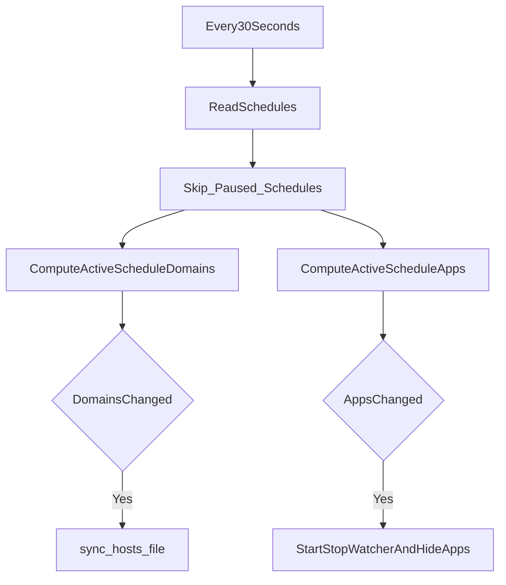

## 8.3 Future schedule activation

On desktop, helper can activate future schedule windows without app UI running, because schedule evaluation is helper-local and persistent.

## 8.4 Active-now semantics

App-side schedule logic in `src/app.js` is also significant:

- `isScheduleSegmentActiveNow()` is used for current UI state,
- it handles cross-midnight segments,
- it handles all-day segments (`start == end`),
- it is pause-aware.

This is important because desktop behavior is split between:

- app-authored intent and UI calculations, and
- helper-owned persistent schedule enforcement.

---

## 9) Merge semantics and overlap correctness

Effective desktop enforcement is a composition of:

- manual one-off blocks,
- currently active schedule windows.

Consequences:

- shared domains remain blocked while any source is active,
- one block override does not collapse unrelated overlapping rules,
- one-off and schedule on same blocklist compose safely.

This is a key correctness property for concurrent blocking scenarios.

`hasAnyEnforcedBlocks()` exists so UI gating follows real current enforcement rather than naive "there is some state in arrays" checks.

This matters for:

- override-all visibility,
- uninstall gating,
- settings states,
- operator messaging.

---

## 10) Override architecture

Frontend handles challenge UX (`src/app.js`) and dispatches scoped clear commands to helper.

Important paths:

- scoped clear uses identity-aware semantics (blocklist/target-specific),
- override-all uses broad clear semantics intentionally,
- helper applies state mutation + resync, preventing UI-only divergence.

This keeps override behavior deterministic in multi-block situations.

### 10.1 Override difficulty configuration and max difficulty mode

Override difficulty (friction settings) lives on each blocklist and controls the challenge required to override a block: type (random words, random gibberish, or custom text), character count, and optional **max difficulty** lock.

**Data model** (persisted in `blocklist.overrideDifficulty`):

- `type`: `'random-words'` | `'gibberish'` | `'custom'`
- `count`: number of characters (for random types) or length of custom text
- `maxDifficulty`: boolean — when true, effective challenge is always max for the chosen random type (7500 for random-words, 5000 for gibberish)
- `countBeforeMax`: when `maxDifficulty` is true, stored so unchecking restores this count
- `typeBeforeMax`: when `maxDifficulty` is true, stored so unchecking restores this type
- `customText`: used only when `type === 'custom'`

**Max difficulty behavior:**

- When the user checks “Max difficulty”:
  - the dropdown is restricted to Random Words and Random Gibberish,
  - if the current type was Custom Text, it switches to Random Words,
  - the character count is set and locked to the max for the selected type,
  - previous type and count are stored for restoration.
- When the user unchecks:
  - Custom Text is re-added to the dropdown,
  - dropdown and count are restored to the prior stored values.

**Code locations:**

- UI: `src/index.html`
- styles: `src/styles.css`
- logic: `src/app.js`

### 10.2 Blocklist duplication

Blocklist duplication creates a full copy of a blocklist (and its schedule if present) with a new id and a derived name; the duplicate is never active.

**Entry point:** `duplicateBlocklist(id)` in `src/app.js`.

**What is copied:**

- blocklist properties,
- override settings including max-difficulty-related fields,
- schedule if present, with a new schedule id and new `blocklistId`.

**Naming semantics:**

- “X” → “X copy” → “X copy 2” → “X copy 3”
- gap-fill and content-based chain rules are implemented in `src/app.js`

### 10.3 Start / schedule / reconciliation flow

Desktop startup and desktop block/schedule start share one important pattern:

- refresh helper status,
- decide whether helper is ready,
- if ready, use helper command path,
- if not ready, choose install/update/repair modal,
- after successful helper readiness, continue pending block or schedule work.

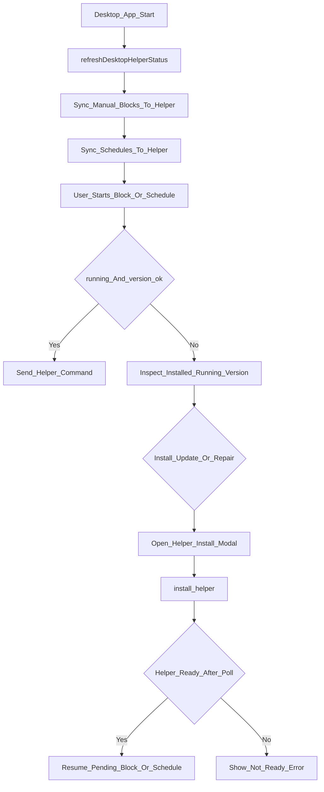

---

## 11) Helper lifecycle and versioning (desktop)

## 11.1 Install/update/repair model

`src-tauri/src/commands/helper.rs` handles:

- helper status checks,
- install path and elevation flow,
- version compatibility checks via `EXPECTED_HELPER_VERSION`,
- reinstall/update when helper is outdated,
- repair/reinstall when helper is installed but not running.

The frontend in `src/app.js` now distinguishes three real modal states:

- `install`
- `update`
- `repair`

Current visible button labels:

- `install` → `Proceed`
- `update` → `Update Helper`
- `repair` → `Reinstall Helper`

Before starting a block, the frontend re-verifies helper readiness when it believes the helper may be available. This avoids using a stale cached helper-available state.

## 11.2 Runtime persistence

- macOS: launch daemon registration and privileged helper path.
- Windows: scheduled task setup and elevated helper execution path.

## 11.3 Manual helper uninstall

Uninstall command path:

- attempt graceful helper `uninstall` command,
- fallback to force cleanup path if needed.

Fallback cleanup now also tries to converge hosts-file cleanup rather than only removing helper artifacts.

## 11.4 Desktop helper: full UI-to-helper flow (start, stop, override, install, uninstall)

The flows below show the frontend (`src/app.js`), Tauri (`helper.rs`), and helper daemon (TCP on Windows, Unix socket on macOS).

**Start block (desktop)**

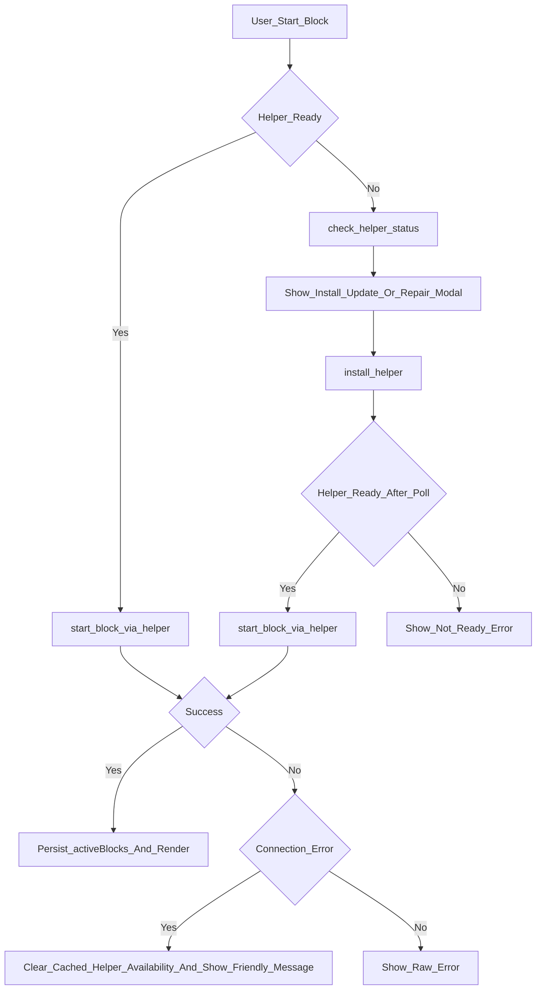

**Stop block / Override**

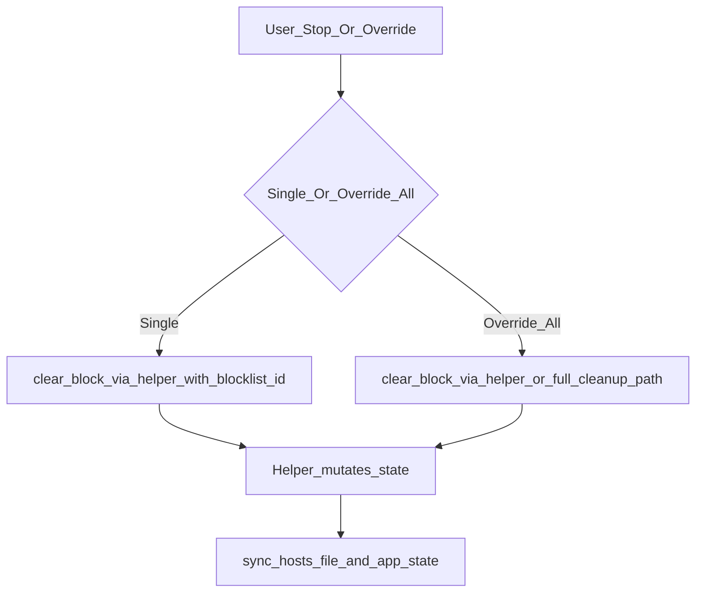

**Helper install**

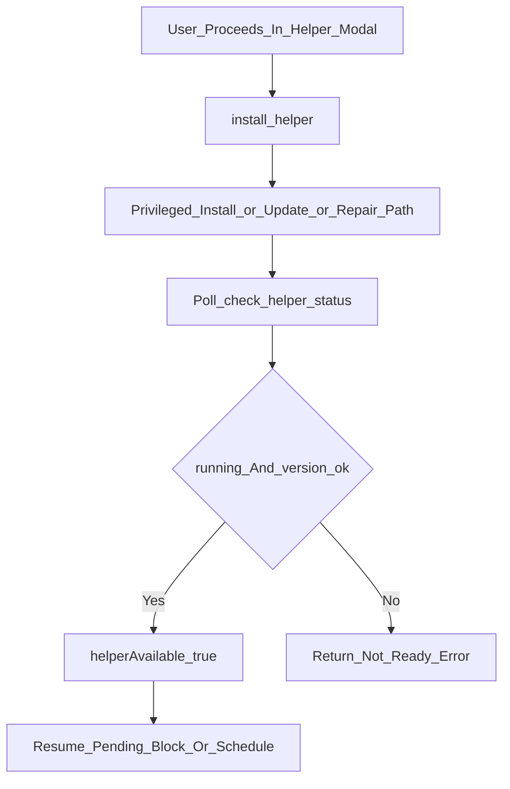

**Helper uninstall**

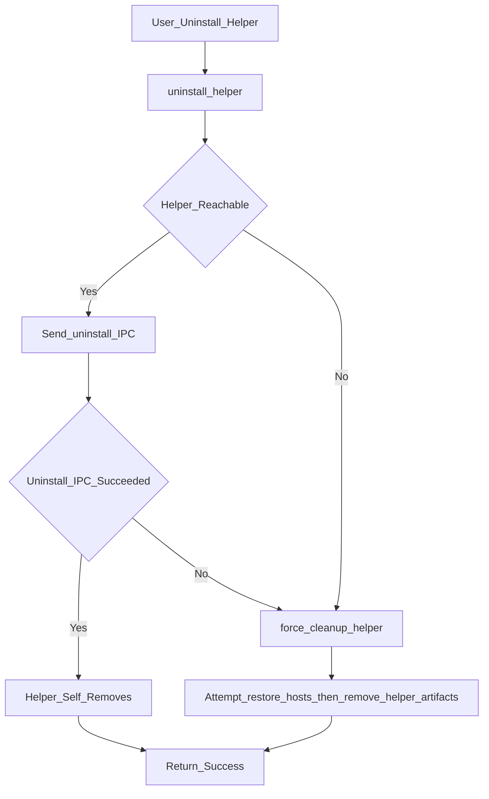

**Ongoing sync to helper** (called from various flows):

- `set_schedules_via_helper`
- `set_blocked_apps_via_helper`
- `set_keep_blocking_on_uninstall_via_helper`

## 11.5 Diagnostics surface

Desktop diagnostics now expose:

- helper status (`installed`, `running`, `version`, `version_ok`)
- expected helper version
- hosts file contents
- helper state file contents
- relevant artifact paths
- helper log tail
- install log tail where available

The UI path is `openDiagnosticsModal()` in `src/app.js`.

The backend path is `get_helper_diagnostics()` in `src-tauri/src/commands/helper.rs`.

This is the preferred surface for deep machine-level troubleshooting.

---

## 12) App close vs app uninstall semantics (desktop)

## 12.1 App close

Closing app window does not stop helper runtime. Helper loops continue:

- expiry,
- schedule evaluation,
- app watcher.

## 12.2 App uninstall/removal

Helper `app_existence_checker()` (5-minute cadence) decides cleanup based on:

- app presence,
- shared app-data presence,
- `keepBlockingOnUninstall` (helper-owned preference),
- whether active/configured enforcement state exists.

Current implementation specifics (`helper-daemon/src/main.rs`):

- `check_app_install_state()` returns:
  - `Detected`
  - `NotDetectedButSharedDataPresent`
  - `NotDetected`
- the helper is intentionally conservative when shared app data still exists
- keep-blocking preference is read from helper state and defaults to `true` when absent
- active-manual check uses time-based predicate (`end_time > now`), not simple non-empty check.

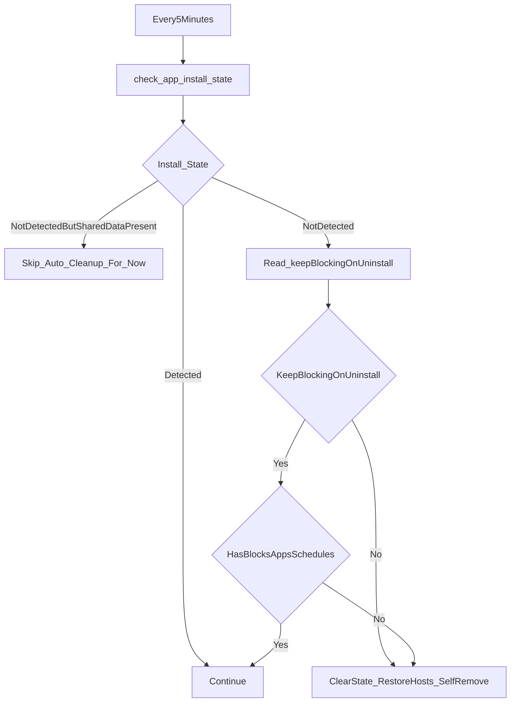

Cleanup path includes:

- clearing in-memory state,
- persisting empty helper state,
- restoring hosts,
- deleting helper state file,
- self-removal from OS startup mechanism.

Self-removal internals:

- `perform_self_cleanup()` executes platform-specific teardown:
  - macOS: launchd removal + helper/plist cleanup,
  - Windows: scheduled task removal + helper artifact cleanup + firewall-rule cleanup.

---

## 13) iOS architecture specifics

iOS does not use a helper daemon. Enforcement is delegated to Apple’s Screen Time APIs (FamilyControls, ManagedSettings, DeviceActivity). The app talks to these via the Tauri Screen Time plugin (`tauri-plugin-screentime`), which is implemented in Swift on iOS and invoked from `src/app.js` through `plugin:screentime|...` commands.

### 13.1 Runtime and authority model

- **No helper:** There is no privileged helper process on iOS. All blocking is done by the system via Screen Time.
- **Plugin:** `tauri-plugin-screentime` (Rust bridge in `src/mobile.rs`, native implementation in `tauri-plugin-screentime/ios/Sources/ScreentimePlugin.swift`) exposes commands that the frontend calls when `isIOS` is true.
- **Two enforcement stores:** The plugin uses two `ManagedSettingsStore` instances so manual blocks and scheduled blocks can coexist without overwriting each other:
  - **Default store** (`ManagedSettingsStore()`): used for manual (one-off) blocks.
  - **Named store** (`ManagedSettingsStore(named: .init("schedule"))`): used by the DeviceActivityMonitor extension when a scheduled time window is active.

### 13.2 Authorization

- **API:** `AuthorizationCenter.shared.requestAuthorization(for: .individual)` (FamilyControls).
- **Frontend:** On load, when `isIOS` is true, the app calls `checkScreentimeAuth()`. Before starting a block, if authorization is missing, the app can call `requestScreentimeAuth()`.
- **Plugin:** Blocking commands check authorization and return an error if not granted.

### 13.3 Website blocking pipeline (iOS)

- `src/app.js` computes desired blocked domains and calls Screen Time plugin commands.
- The plugin converts domains to `WebDomain` and applies them via `ManagedSettingsStore`.
- The plugin clears both manual and schedule stores on full clear.
- ManagedSettingsStore persists at the OS level.

### 13.4 App and category blocking (iOS)

- iOS uses opaque Screen Time tokens, not desktop-style app names.
- The activity picker stores selection in App Group storage.
- Manual blocks and schedules use these stored token payloads.

### 13.5 Manual (one-off) block flow

1. user starts a block,
2. frontend ensures authorization,
3. plugin applies website and app/category payloads,
4. frontend updates app-owned active-block state.

### 13.6 Scheduled blocks (DeviceActivity and extension)

- schedules are registered with `DeviceActivityCenter`
- payloads are stored in App Group shared storage
- `DeviceActivityMonitor` reads those payloads at schedule boundaries
- the named schedule store is updated by the extension

Scheduled time windows from the UI do activate on iOS when the app has synced those schedules to the plugin.

### 13.7 Merge semantics and store separation

- manual blocks use the default store
- scheduled blocks use the named schedule store
- the OS enforces both

### 13.8 End-to-end command path (app → Screen Time)

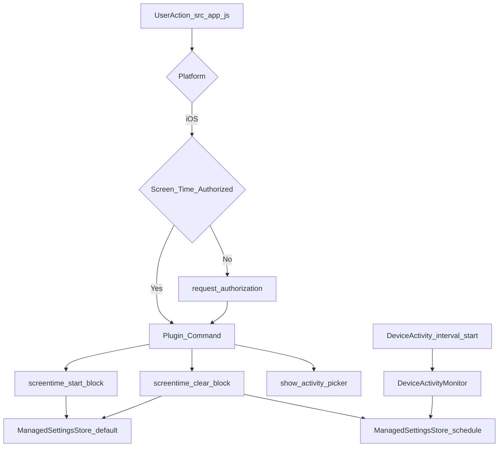

### 13.9 App Group and persistence

App Group storage carries:

- activity picker selection
- schedule payloads
- manual block state payloads used by resume/end flows

### 13.10 iOS-specific constraints and limitations

- 50-domain cap per store,
- no desktop-style helper daemon,
- override challenge is app-side, not system-side,
- authorization is required for all blocking,
- keep-blocking-on-uninstall does not have a desktop-style equivalent.

---

## 14) Data paths and persistence locations

## 14.1 App data

- macOS legacy per-user: `~/Library/Application Support/com.redd.block/redd-block-data.json`
- Windows legacy per-user: `%APPDATA%\com.redd.block\redd-block-data.json`
- macOS shared canonical: `/var/lib/redd-block/redd-block-data.json`
- Windows shared canonical: `%PROGRAMDATA%\ReDD Block\redd-block-data.json`
- iOS: Tauri-managed app sandbox path

## 14.2 Helper data (desktop only)

- macOS: `/var/lib/redd-block/helper-state.json`
- Windows: `%PROGRAMDATA%\ReDD Block\helper-state.json`

## 14.3 Hosts backup (desktop only)

- macOS: `/etc/hosts.redd-backup`
- Windows: `C:\Windows\System32\drivers\etc\hosts.redd-backup`

## 14.4 Diagnostics-related artifacts

- macOS helper log: `/var/log/redd-block-helper.log`
- Windows helper log: `%PROGRAMDATA%\ReDD Block\helper.log`
- Windows install log: `%PROGRAMDATA%\ReDD Block\install.log`

---

## 15) Safety and security mechanisms

- protected domain filtering (frontend + helper),
- protected app filtering (frontend + helper),
- hosts backup/restore safety net,
- localhost validity checks before/after writes,
- constrained privileged operations in helper lifecycle paths,
- compatibility defaults for missing fields/version drift paths.

These reduce risk of system networking breakage and self-lockout.

---

## 16) Known technical constraints and non-obvious behaviors

- schedule transitions are loop-driven, so boundary effects are interval-bounded,
- browser-level caching can delay visible effect after hosts changes even when helper completed correctly,
- helper upgrade mismatch can disable helper-available paths until reinstall/update,
- on Windows, the helper process is not restarted on crash (scheduled task runs at logon only),
- if the helper exits unexpectedly, the app re-verifies readiness before start block and can fall back into repair/reinstall UX,
- desktop app-block timing still depends on effective blocked-app state transitions, not hosts model,
- local desktop dev builds and installed release builds currently share one machine-global helper installation, IPC endpoint, and helper-state surface,
- iOS behavior differs by Screen Time API constraints and should not be reasoned about through the desktop helper model.
