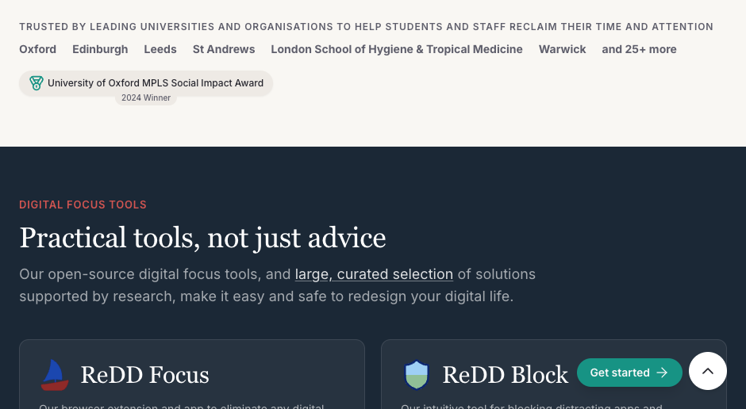
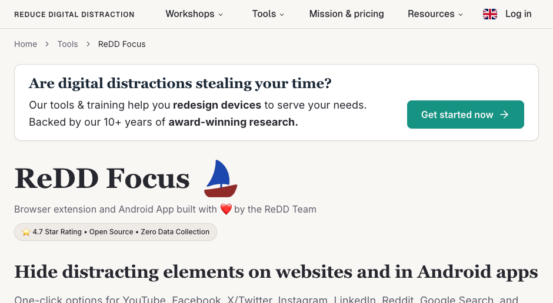
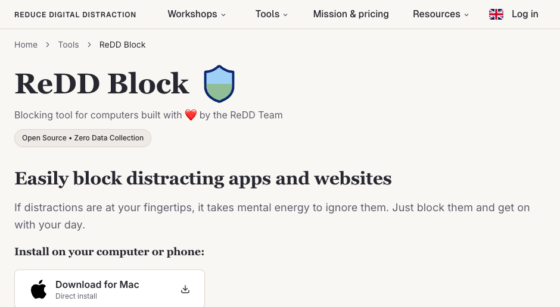
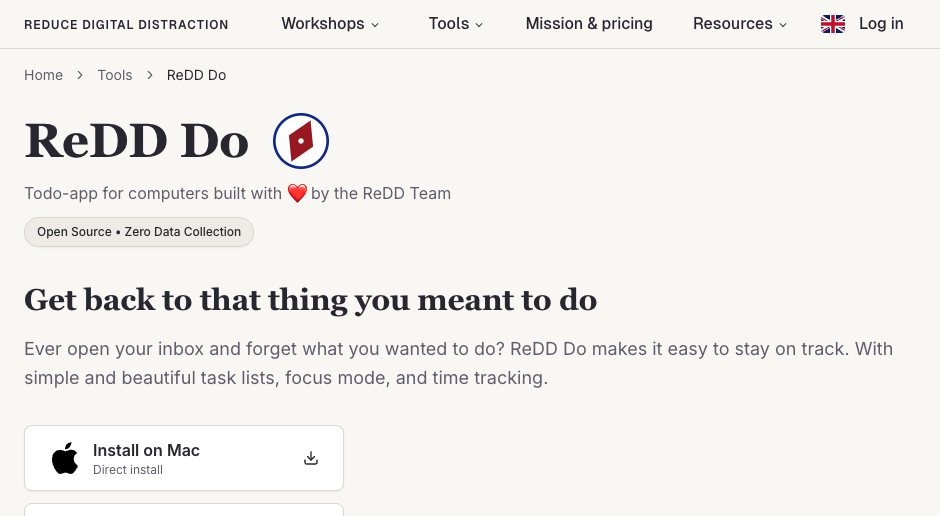
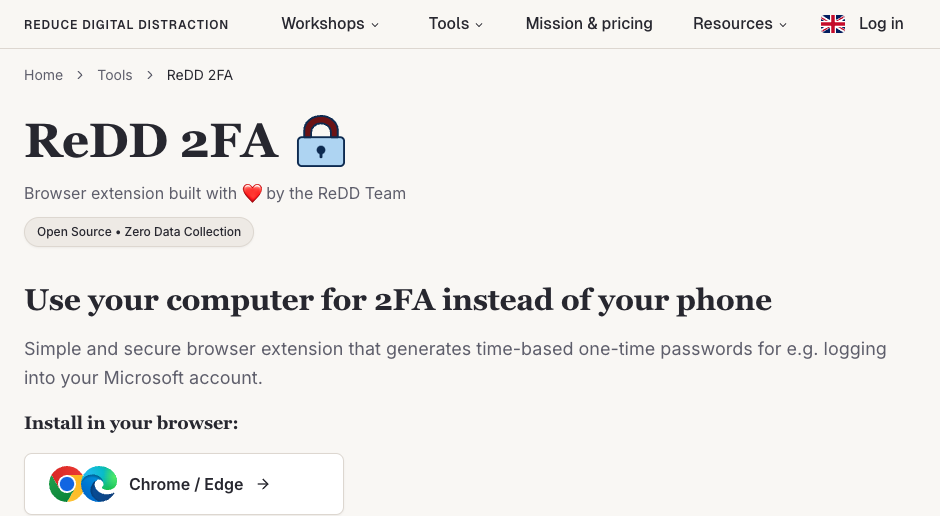

# ReDD Tool Design Language

This document captures the current ReDD website design language and translates it into a portable spec for the four digital focus tools: `ReDD Focus`, `ReDD Block`, `ReDD Do`, and `ReDD 2FA`.

It is based on the current website implementation in:
- `app/(main)/globals.css`
- `tailwind.config.ts`
- `components/DigitalFocusToolsSection.tsx`
- `app/(main)/tools/reddfocus/ReDDFocusClient.tsx`
- `app/(main)/tools/reddblock/ReDDBlockClient.tsx`
- `app/(main)/tools/do/ReDDTodoClient.tsx`
- `app/(main)/tools/redd2fa/ReDD2FAClient.tsx`

## What To Preserve
- Calm, high-trust presentation: light cream backgrounds, dark navy structure, restrained accent colors.
- Research-backed credibility: editorial serif headlines plus clean sans-serif body copy.
- Practicality over hype: generous spacing, readable line lengths, obvious primary actions, low visual noise.
- Soft surfaces instead of hard contrast: subtle borders, rounded cards, gentle shadows, muted badges.

## Screenshot Reference
These screenshots are included as visual anchors for the language below.

### Home Hero

Use this as the reference for:
- serif-led headlines
- cream page background
- restrained teal accent on key words
- spacious, editorial layout

### Home Tool Strip

Use this as the reference for:
- dark navy section treatment
- coral section label over navy
- white-on-navy cards with subtle borders
- interactive expansion behavior

### ReDD Focus Hero

Use this as the reference for:
- breadcrumb + trust banner + product hero stack
- primary CTA styling
- product logo placement
- badge and headline hierarchy

### ReDD Block Hero

Use this as the reference for:
- installer-card CTA pattern
- product-page typography hierarchy
- cream background with white action surfaces

### ReDD Do Hero

Use this as the reference for:
- task-product tone that still stays within the brand shell
- white download cards on cream background
- body copy rhythm and line length

### ReDD 2FA Hero

Use this as the reference for:
- extension-first CTA stack
- product icon sizing within the shared shell
- shared badge, spacing, and heading rhythm

## Canonical Portable Tokens
The website currently has a small amount of token drift between `globals.css` and `tailwind.config.ts` for the red, teal, and blue accents. For tool adoption, use the portable tokens below as the canonical set, while preserving the legacy aliases listed later for compatibility.

### Core Palette

| Token | Portable value | Current website source(s) | Use |
| --- | --- | --- | --- |
| `color.bg.canvas` | `#faf8f5` | `--background`, `--cream`, `reddCream` | Main page background |
| `color.bg.subtle` | `#f1eee9` | `--secondary`, `--warm-grey` | Alternate section backgrounds, muted badges |
| `color.bg.card` | `#ffffff` | card surfaces across tool pages | Cards and installer buttons on light sections |
| `color.text.primary` | `#1e2d3e` | `reddNavy`, `--navy` | Headlines, strong text, dark sections |
| `color.text.body` | `#2c2c35` | `--foreground` | Standard body text |
| `color.text.muted` | `#696977` | `--muted-foreground` | Metadata, breadcrumb text, support copy |
| `color.border.subtle` | `#e1dcd6` | `--border`, `--input` | Light card borders and separators |
| `color.brand.coral` | `#d4605a` | `redd` | Section label, sparing warm accent |
| `color.brand.teal` | `#2a9d8f` | `reddTeal` | Primary CTA background, highlighted keywords |
| `color.brand.blue` | `#4a90e2` | `reddAccentBlue` | Links, secondary emphasis |
| `color.brand.navy` | `#1e2d3e` | `reddNavy`, `--navy` | Dark sections, strong headings, high-trust shell |

### Legacy Aliases In Current Site Code
Keep these as aliases when porting old UI, but do not treat them as the long-term source of truth:

| Alias | Current value | Recommended mapping |
| --- | --- | --- |
| `--coral` | `#d3625a` | map to `color.brand.coral` |
| `--teal` | `#2a9d90` | map to `color.brand.teal` |
| `--accent-blue` | `#4b91e2` | map to `color.brand.blue` |
| `reddPink` | `#fbeae9` | use only as a soft accent surface |
| `reddBlue` | `#e8f1fa` | use only as a soft info surface |

## Typography

### Font Roles
- `font.heading`: Georgia, `"Times New Roman"`, serif
- `font.body`: Inter, Arial, Helvetica, sans-serif
- `font.utility`: Geist Sans for technical UI only when needed, not as the main editorial voice

### Type Rules

| Role | Recommended treatment | Current site pattern |
| --- | --- | --- |
| Display headline | serif, heavy, tight tracking, navy | home hero and tool page `h1` |
| Section headline | serif, navy, large but calmer than hero | landing and tool-section `h2` |
| Body copy | Inter, regular, high readability | default `body` and hero descriptions |
| Metadata / breadcrumbs | Inter, muted text, small size | tool-page breadcrumb and subtitles |
| Buttons / CTAs | Inter, semibold | `components/ui/button.tsx` |
| Badges | Inter, small, medium-to-semibold | product trust badges |

### Tone Guidance
- Headlines should feel editorial, credible, and composed.
- Body copy should be plainspoken and practical.
- Avoid startup-style all-caps slogans outside small section labels.

## Spacing, Radius, And Layout

### Spacing Rhythm
Use an `8px` base rhythm with these common steps:
- `4px`, `8px`, `12px`, `16px`, `24px`, `32px`, `48px`, `64px`

This matches how the current site clusters content:
- compact UI details use `8px` to `16px`
- cards and form-like actions use `16px` to `24px`
- section padding usually starts around `48px` and expands above that

### Radius
- Standard radius: `8px`
- Card radius: `12px` when used for major product cards
- Rounded pill badges: full pill / capsule

Current source:
- `--radius: 0.5rem`
- `Card`: `rounded-xl`
- `Button`: `rounded-lg`

### Layout
- Max content width: `1200px`
- Standard page padding: `24px` horizontal
- Prefer left-aligned text blocks with generous whitespace over center-heavy marketing layouts

## Surfaces And Components

### Page Backgrounds
- Default canvas: cream
- Dark emphasis section: navy
- Muted section: warm grey / secondary

### Cards
- Use white or translucent navy cards depending on section background.
- Keep borders subtle and readable.
- Use shadows lightly; the site favors gentle depth over dramatic elevation.

### Buttons
- Primary button: teal background, light text, medium rounding, semibold label
- Secondary/outline button: light background, subtle border, dark text
- Link-style action: blue text with underline behavior

### Badges
- Use soft neutral pills for trust statements like `Open Source` or `Zero Data Collection`.
- Keep badges low-contrast and informational, not loud.

### Breadcrumbs
- Muted text by default
- darker text on hover/current
- lightweight and compact, never dominant

### Dropdowns / Menus
- Light popover background
- subtle border and shadow
- maintain small text and practical spacing

## Interaction Language

### Motion
- Default transition speed: `200ms` to `300ms`
- Motion should feel supportive, not attention-grabbing
- Prefer fades, subtle hover elevation, and size changes over large movement

### Current Signature Behaviors Worth Keeping
- expanding tool cards on the landing page
- subtle hover-state contrast changes on CTAs
- occasional micro-delight only in special cases, such as the existing button wiggle

### Accessibility Expectations
- Preserve visible focus states
- Keep body text contrast high on light backgrounds
- Avoid using color alone to communicate state

## Product UI Translation Rules
The tools themselves do not need to copy the website literally. They should inherit the same tone and token system.

### Match Exactly
- core palette
- typography roles
- button hierarchy
- card radius and border softness
- badge tone
- link color and hover behavior

### Adapt Per Platform
- density of controls in extension popups
- native menu conventions on desktop or mobile
- input control styling when platform widgets impose constraints
- icon sizing inside constrained toolbars or browser-action popups

### Keep Product-Specific
- product logos
- domain-specific feature illustrations
- interaction models unique to extension popups, native overlays, timers, or authenticator flows
- platform conventions needed for trust and usability

## Rollout Matrix

| Product | Standardize across products | Adapt for platform/runtime | Keep product-specific |
| --- | --- | --- | --- |
| `ReDD Focus` | cream + navy + teal shell, serif headings, badge style, CTA hierarchy | extension popup density, Android-specific controls, temporary overlays | distraction-hiding controls, element picker, platform-specific permission flows |
| `ReDD Block` | hero shell, installer-card styling, typography, trust badges | desktop app settings density, mobile store CTA layout, OS-specific install affordances | blocklist editor, override friction controls, shield-centric iconography |
| `ReDD Do` | typography, light surfaces, card borders, button system, link styling | denser task-list rows, keyboard-heavy desktop layout, always-on-top mini mode | task states, timers, list tabs, productivity-focused layout primitives |
| `ReDD 2FA` | brand shell, CTA styling, badge tone, headings, spacing rhythm | extension popup sizing, security-state emphasis, browser-store CTA affordances | code display, vault/account list patterns, unlock and biometric flows |

## Implementation Notes For Future Cleanup
- The current website uses both CSS variables and Tailwind hex literals for similar colors. When time allows, align `globals.css` and `tailwind.config.ts` to a single canonical palette.
- Prefer semantic tokens like `canvas`, `surface`, `brand.coral`, and `text.muted` in product code, rather than direct hex values.
- If a tool cannot consume Tailwind, mirror the values from `docs/design-language/redd-design-tokens.json`.

## Recommended Adoption Order
1. Import the portable tokens into each product repo.
2. Update typography and button styling before deeper layout work.
3. Normalize cards, badges, and empty states.
4. Only then refine product-specific surfaces so they feel like ReDD without becoming identical clones of the marketing site.
