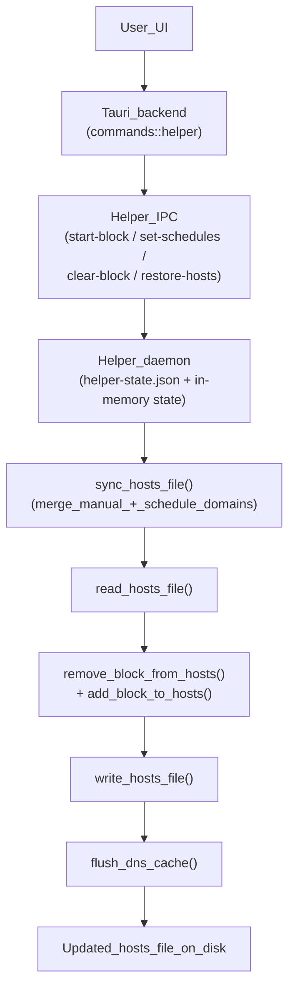
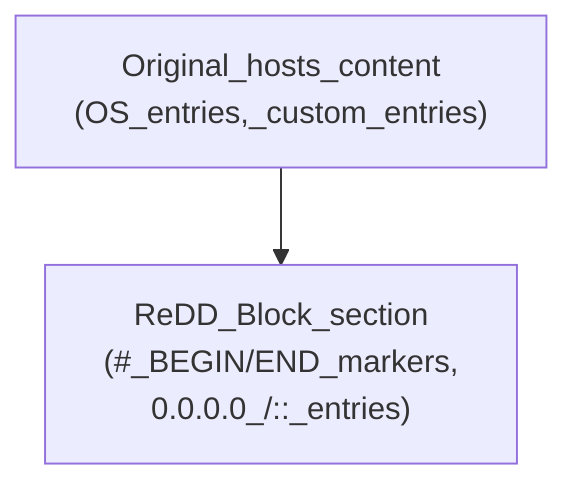
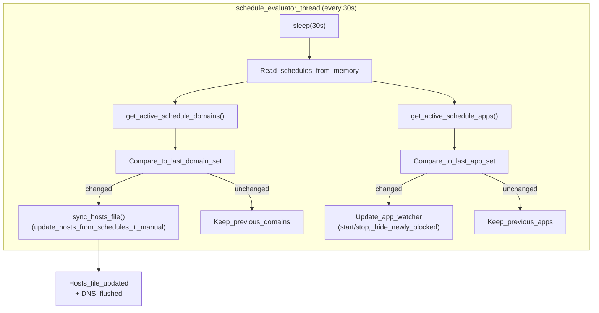
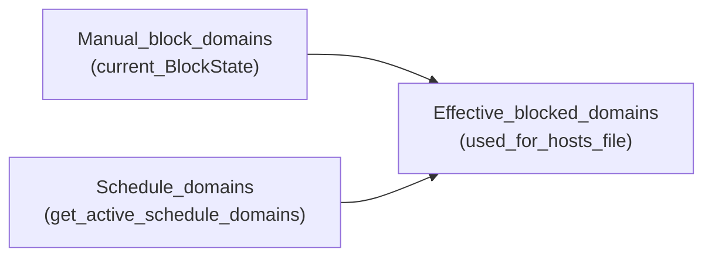
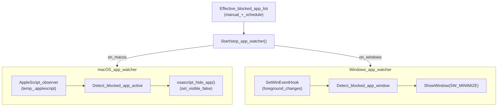
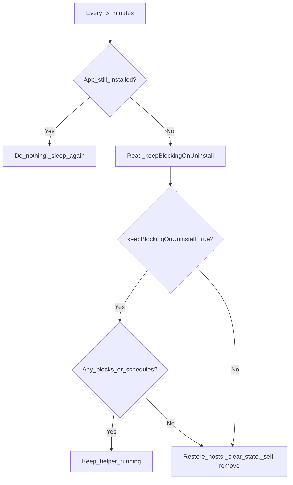
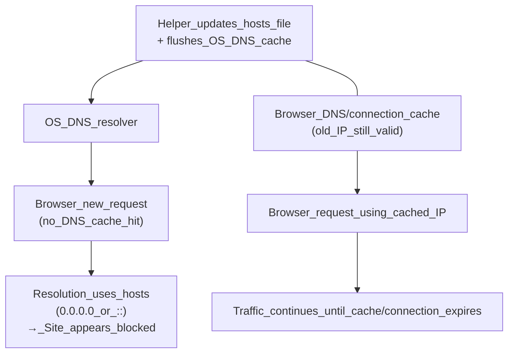

## ReDD Block core mechanics (desktop)

This document explains how ReDD Block works under the hood on macOS and Windows, complementing the high-level overview in `README.md`.

- **Scope**: Desktop website and app blocking via the helper daemon, hosts file, and app watcher.
- **Out of scope**: iOS, which uses the Screen Time API without a hosts file or helper daemon.

There is **no hosts-file watcher**. The helper daemon is the **only** component that writes to the hosts file. The main app sends IPC commands and the helper decides when and how to update the hosts file and DNS cache.

---

## Platforms at a glance (macOS vs Windows)

At a high level, ReDD Block behaves the same on macOS and Windows: a helper daemon runs in the background, talks to the app, and manages hosts and app blocking. The main differences are in **where** the helper lives and **how** it starts.

- **Install location and startup**
  - **macOS**
    - Helper binary is installed as a **launchd daemon** at `/Library/PrivilegedHelperTools/com.redd.block.helper`.
    - launchd configuration ensures it starts automatically at login, without the main app needing to be open.
  - **Windows**
    - Helper is run via a **Scheduled Task** registered with highest privileges.
    - The task is configured to run the helper on user logon, again independent of whether the main app window is open.
- **IPC transport between app and helper**
  - **macOS**: Unix domain socket at `/tmp/redd-block-helper.sock`.
  - **Windows**: TCP loopback connection to `127.0.0.1:62222`.
- **Shared logic**
  - Hosts file management, schedule evaluation, app watcher, and app-existence checks are implemented the same way in shared Rust code, so behavior is consistent across platforms.

---

## How the hosts file works

**Source of truth:** `helper-daemon/src/main.rs`

- **Paths**
  - **Windows**: `C:\Windows\System32\drivers\etc\hosts`
  - **macOS**: `/etc/hosts`
- **Backup and safety**
  - On first modification, the helper creates a clean backup:
    - **Windows**: `C:\Windows\System32\drivers\etc\hosts.redd-backup`
    - **macOS**: `/etc/hosts.redd-backup`
  - The backup has any ReDD Block sections stripped out and is used for restore/cleanup.
  - The helper refuses to write a hosts file that does not contain a `localhost` entry; in that case it restores from backup or writes a minimal valid file.
- **ReDD Block section format**
  - The helper writes a single contiguous block bracketed by markers:
    - Start: `# === BEGIN REDD BLOCK (reddfocus.org) ===`
    - End: `# === END REDD BLOCK (reddfocus.org) ===`
  - Between these markers:
    - A comment: `# Managed by ReDD Block - DO NOT EDIT`
    - For each domain `example.com`:
      - `0.0.0.0 example.com`
      - `0.0.0.0 www.example.com`
      - `:: example.com`
      - `:: www.example.com`
  - Certain domains (localhost, `reddfocus.org`, etc.) are never added (see `is_protected_domain`).

### Hosts write flow

At a high level, all hosts modifications follow this pattern:



### Hosts file layout

Conceptually, the hosts file on disk looks like this:



The helper:

- Reads the full file.
- Strips any previous ReDD Block section.
- Appends a new section (or none, if there are no active domains).

### Platform-specific writing and DNS flush

- **Windows**
  - Writes the hosts file directly with `fs::write(HOSTS_PATH, content)` (rename is avoided because antivirus or the DNS client service often hold locks).
  - Calls `ipconfig /flushdns` (hidden window) after a successful write.
- **macOS**
  - Writes to a temp file (e.g. `/etc/hosts.tmp`), then renames to `/etc/hosts` for atomic updates.
  - Falls back to direct write if rename fails.
  - Flushes DNS via `dscacheutil -flushcache` and `killall -HUP mDNSResponder`.

---

## One-off blocking

One-off blocks are time-limited sessions started from the UI for a given blocklist.

- **Command path**
  - UI calls `start_block_via_helper(domains, end_time, blocklist_id)` in the Tauri backend.
  - Tauri sends an IPC command `{ action: "start-block", domains, endTime, blocklistId }` to the helper.
- **Helper behavior**
  - Creates a `BlockState { domains, end_time, blocklist_id }` in memory.
  - Persists the full helper state (current block, schedules, blocked apps) in `helper-state.json`.
  - Calls `sync_hosts_file(state, schedule_state)` to update the hosts file with the union of:
    - Domains from the current one-off block.
    - Domains from currently active schedule segments.

### One-off block lifecycle

```mermaid
flowchart TD
    startClick["User_clicks_Start_block"] --> tauriCmd["Tauri_start_block_via_helper"]
    tauriCmd --> ipcStart["IPC_command\n{action:\"start-block\"}"]
    ipcStart --> helperStart["Helper_start_block()\n(set_BlockState)"]
    helperStart --> syncAfterStart["sync_hosts_file()\n(write_union_of_domains)"]
    syncAfterStart --> hostsUpdated1["Hosts_file_updated\n+ DNS_flushed"]

    subgraph expiryLoop ["Expiry_checker_thread (every 1s)"]
        checkState["Check_current_BlockState\n(now_>=_end_time?)"] -->|no| sleepAgain["sleep(1s)"]
        sleepAgain --> checkState
        checkState -->|yes| clearCall["clear_block()"]
    end

    hostsUpdated1 --> expiryLoop
    clearCall --> syncAfterClear["sync_hosts_file()\n(remove_one_off,_keep_schedules)"]
    syncAfterClear --> hostsUpdated2["Hosts_file_updated\n(block_expired)"]
```

The 1-second expiry loop explains why one-off blocks typically end very close to the configured time, but not necessarily to the exact millisecond.

---

## Scheduled blocks

Scheduled blocks are defined by segments (day/time ranges) and are evaluated continuously in the helper daemon.

- **Scheduling data flow**
  - The frontend maintains schedule definitions in its own data structures.
  - Whenever schedules change (or on app startup), it calls `set_schedules_via_helper` with normalized segments and domains.
  - The helper stores schedules in memory and in `helper-state.json` as `HelperSchedule` entries.
- **Activation and deactivation**
  - A `schedule_evaluator` thread wakes every **30 seconds**:
    - Computes `get_active_schedule_domains(schedules)` from the current local time and each `ScheduleSegment`:
      - Same-day segments (e.g. 09:00–17:00).
      - Cross-midnight segments (e.g. 22:00–02:00) using “evening or next-morning” logic.
    - Computes `get_active_schedule_apps(schedules)` similarly for app blocking.
    - If the active-domain set changed since last run, calls `sync_hosts_file`.
    - If the active-app set changed, starts/stops the app watcher and hides newly blocked apps.

### Scheduled block evaluation loop



Because the loop interval is 30 seconds, schedule-based website blocking can take **up to 30 seconds** to activate or deactivate after a segment boundary is crossed.

---

## Overlaps between one-off and scheduled blocks

ReDD Block intentionally **merges** manual (one-off) and scheduled domains so that overlapping blocks behave intuitively.

- **Merge policy**
  - `sync_hosts_file` constructs a union of:
    - Domains from `state.current_block` (if any).
    - Domains from currently active schedule segments.
  - A `HashSet` ensures each domain appears only once.
- **Implications**
  - If Blocklist A (one-off) and Blocklist B (schedule) both contain `shared.com`:
    - `shared.com` is blocked while either block is active.
    - Stopping Blocklist A does **not** unblock `shared.com` as long as B’s schedule is active.
  - If a single blocklist has both a one-off and a schedule:
    - The schedule continues to enforce blocking after the one-off ends.

### Domain union visualization



The `unionSet` is what `add_block_to_hosts` uses to build the ReDD Block section in the hosts file.

---

## App watcher (macOS vs Windows)

The app watcher manages **app blocking**, not website blocking. It hides or minimizes specified apps whenever they become active.

- **When the watcher runs**
  - The helper maintains:
    - A list of manually blocked apps.
    - A list of schedule-based blocked apps.
  - If there is at least one effective blocked app, it ensures the watcher is running.
  - If there are no manual or schedule apps, it stops the watcher.

### macOS app watcher

- Writes a temporary AppleScript in the system temp directory that:
  - Uses “System Events” to observe application activation.
  - Detects when any app from the blocked list becomes active.
- When a blocked app is detected, the helper calls another AppleScript snippet:
  - `tell application "System Events" to set visible of application process "<AppName>" to false`
- Some apps are protected (e.g. ReDD Block itself) and are never hidden.

### Windows app watcher

- Uses native Win32 APIs:
  - `SetWinEventHook` to receive foreground-window and focus-change events.
  - Enumerates windows and matches processes against the blocked-app list.
  - Minimizes matching windows using `ShowWindow(hwnd, SW_MINIMIZE)` and related calls.
- Runs a message loop inside the watcher thread; `stop_app_watcher` posts `WM_QUIT` to exit the loop.

### App watcher overview



---

## Helper lifecycle (install, upgrade, uninstall)

The helper is a small, separate program that runs with elevated privileges so it can edit the hosts file and manage apps.

- **Installation**
  - The first time you start a block, the app checks whether the helper is installed and up to date.
  - If not, it walks you through a one-time setup:
    - **macOS**: the system shows a password prompt to install a privileged helper under `/Library/PrivilegedHelperTools` and register it with launchd.
    - **Windows**: a UAC prompt appears to allow creating a Scheduled Task that runs the helper with the required privileges.
  - After this, the helper starts automatically at login; you do not need to repeat the setup.
- **Upgrade**
  - The helper has its own version number (see `EXPECTED_HELPER_VERSION` in `src-tauri/src/commands/helper.rs`).
  - When the app detects that the installed helper version is older than expected, it shows an update prompt.
  - Accepting the prompt reinstalls the helper in place (replacing the binary / task) but keeps:
    - Your user data and settings.
    - The hosts backup file used for restore.
- **Uninstall from settings**
  - In the app’s Settings → Advanced, there is a **“Remove helper now”** button.
  - This is only enabled when no blocks are running, to avoid leaving stale entries behind.
  - When clicked:
    - The app sends an `uninstall` command to the helper.
    - The helper restores the hosts file from its backup, clears its saved state, removes its launchd / Scheduled Task registration, and deletes its own files.
    - If an older helper does not understand the `uninstall` command, the app falls back to a more forceful cleanup path.

---

## Persistence when the app is closed or uninstalled

Because the helper is installed at OS level, it can continue blocking **even when the main ReDD Block window is not running**.

- **When the app window is closed**
  - The helper keeps running:
    - One-off blocks continue until their end time, watched by the 1-second `expiry_checker` loop.
    - Scheduled blocks continue to turn on/off based on the 30-second `schedule_evaluator`.
    - App blocking continues via the app watcher.
  - Reopening the app simply reconnects to the helper and shows the current state.
- **When the app is uninstalled or moved to Trash**
  - The helper does not immediately assume it should disappear; instead it checks periodically whether the app still exists and what your preference is.
  - A background thread (`app_existence_checker`) runs inside the helper:
    - Every **5 minutes**, it:
      - Looks for the main app in standard install locations (`check_app_exists`).
      - Reads your **“Keep blocking after app removal”** setting from the user data file (`read_user_setting_keep_blocking`).
      - Checks whether there are any active one-off blocks, blocked apps, or configured schedules.
    - Based on this, it either keeps running or performs a full cleanup (described below).
- **Cleanup and self-removal**
  - When the helper decides it should stop (see toggle behavior below), it:
    - Clears its in-memory state and writes an empty `helper-state.json`.
    - Restores the hosts file from the backup (removing all ReDD Block entries).
    - Deletes its state file from disk.
    - Calls `perform_self_cleanup` to remove itself (and its launchd / Scheduled Task registration).

### Keep blocking after app removal (toggle)

The **“Keep blocking after app removal”** toggle lets you decide what happens if you delete or uninstall the main app while blocks or schedules are still configured.

- **Where it lives**
  - In the Settings → Advanced section as a checkbox (`keep-blocking-toggle` in `src/app.js`).
  - Persisted as `settings.keepBlockingOnUninstall` in the app’s JSON data file (`redd-block-data.json`).
  - The helper reads this setting directly from the same data file when deciding what to do after the app disappears.
- **Default behavior**
  - If the setting is missing, the helper assumes **ON** (`true`), so blocking continues by default after app removal.

#### When the toggle is ON

- If the main app is no longer installed, but:
  - There is an active one-off block, **or**
  - There are blocked apps configured, **or**
  - There are schedules set up (even if not currently active),
- Then the helper **keeps running** and continues enforcing those rules.
- Once all blocks finish naturally and all schedules are cleared, the helper will then clean itself up.

#### When the toggle is OFF

- If the main app is no longer installed, the next 5-minute check tells the helper to **stop immediately**, regardless of any remaining blocks or schedules.
- The helper then:
  - Clears its state.
  - Restores the hosts file from backup.
  - Removes itself from the system.

#### Decision flow for app removal



This is why test scenarios in the manual checklist wait a few minutes after uninstall: the helper’s decision is driven by this 5-minute checker plus your toggle choice.

---

## Core blocking behaviors in plain language

This section summarizes what you actually experience as a user and how it maps to the mechanics described above.

- **One-off blocks**
  - You pick a blocklist and a duration, then press **Start**.
  - The helper immediately adds those domains to the hosts file (merged with any active schedules), so new visits to those sites fail.
  - If you close the app window, the block keeps running until the timer finishes or you override/stop it from the app.
- **Scheduled blocks**
  - You define days and times when a blocklist should be active.
  - Every ~30 seconds, the helper checks whether the current time falls inside any of those segments and updates the hosts/app blocking accordingly.
  - This means there can be up to 30 seconds of delay when a schedule starts or ends.
- **Overlapping blocks**
  - If multiple blocks or schedules include the same domain, that domain stays blocked as long as **any** of them is active.
  - Stopping one blocklist does not unblock domains that are still covered by another blocklist or schedule.
- **Override All**
  - The **Override All Blocks** control in Settings tells the app to clear **every** active block and schedule at once.
  - After this, the helper sees that there are no active domains or schedules when it next syncs and removes all ReDD Block entries from the hosts file.
- **Clean hosts file**
  - The **Clean hosts file** button is a “panic button” for stale entries.
  - It is disabled while blocks are running.
  - When used, it asks for confirmation, then tells the helper to:
    - Remove the ReDD Block section from the hosts file (or restore from backup if needed).
    - Flush the OS DNS cache, so new lookups see a clean state.
- **App blocking**
  - When you configure blocked apps and start a block (or have a schedule with apps), the helper watches for those apps to appear in the foreground.
  - If they do, it immediately hides (macOS) or minimizes (Windows) them.
  - This continues even if the main ReDD Block window is closed, as long as the helper is still installed and the app-existence checker has not decided to clean up.

---

## From hosts file to browser behavior

ReDD Block controls **DNS resolution** by editing the hosts file and flushing the **OS** DNS cache. It does **not** directly control browser caching or connections.

- **What ReDD Block guarantees**
  - After a hosts update, the OS resolver will see the new mappings on the next lookup, because:
    - The hosts file has been updated.
    - The OS DNS cache has been flushed.
- **Why some sites block “instantly”**
  - A new request that triggers a fresh DNS lookup (e.g. new tab to `example.com`) asks the OS resolver for the IP.
  - The OS consults the updated hosts file and returns `0.0.0.0` / `::`, so the site appears blocked immediately.
- **Why some sites appear delayed or “never” blocked**
  - **Browser DNS cache**: Browsers cache hostnames to IP addresses for a time-to-live (TTL). Until this cache expires or is cleared, the browser may not re-query the OS.
  - **Persistent connections**: Existing HTTP or TLS connections (e.g. keep-alive) continue to use the old IP as long as the connection stays open.
  - **Service workers / in-page behavior**: Some sites may continue serving cached resources even after the underlying connection starts failing.

### Hosts update vs browser caching



In practice:

- Opening a **new tab** or performing a **hard reload** is more likely to hit the updated hosts mapping quickly.
- Some browsers provide internal DNS/cache views and clear buttons (e.g. `chrome://net-internals/`–style pages) that can be used when testing.

---

## Summary

- Website blocking uses the **hosts file** plus DNS cache flushing, managed entirely by the **helper daemon**.
- One-off blocks and schedules both contribute to a single **effective domain set** that is written to the hosts file.
- App blocking is handled by the **app watcher**, which is separate from the hosts mechanism and uses platform-specific APIs.
- Browser behavior (DNS and HTTP caching) explains why some sites are blocked instantly while others appear to lag behind the hosts updates.

